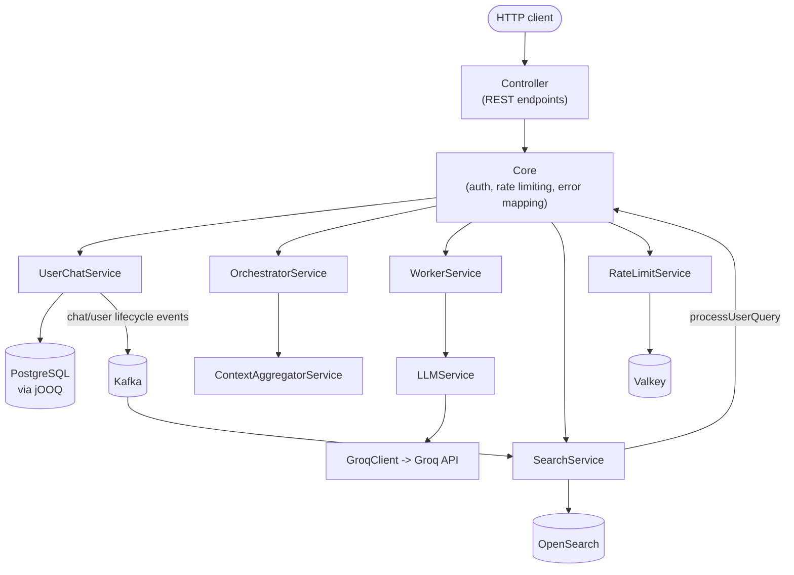

# Architecture

## High-level overview

## Package reference

Each package's own `package-info.java` description, verbatim:

| Package | Description |
|---|---|
| `controller` | HTTP entry points exposing every `Core` operation |
| `core` | Wires the Gate, Orchestrator, and Worker services together |
| `services` | Application services composing repositories and clients |
| `repository` | Repository interfaces defining persistence contracts for entities |
| `repository.jooq` | jOOQ-backed implementations of the repository interfaces |
| `repository.init` | Idempotent database schema initialization run at application startup |
| `repository.observers` | Observers notified whenever repository data changes, e.g. publishing chat lifecycle events to Kafka |
| `client` | HTTP clients for external APIs (Groq, LeetCode, Codeforces, GitHub, Profile) |
| `api` | Thin wrappers around external client SDKs used directly by application code, e.g. the OpenSearch Java client |
| `queue` | Kafka producer/consumer wiring for publishing and subscribing to application events |
| `cache` | In-process caching support for expensive or frequently reused data |
| `config` | Spring `@ConfigurationProperties` records for external APIs |
| `pojo` | Request/response envelopes exchanged with API consumers |
| `objects` | Reader-friendly DTOs composed of raw external API responses or internal entities |
| `dto` | Data transfer objects published to external systems, e.g. Kafka event payloads |
| `models` | Request/response DTOs for external APIs (Groq, LeetCode, GitHub, OpenSearch query DSL, ...) |
| `entity` | Domain entities persisted by the repository layer |
| `enums` | Enumerated constants shared across the application |
| `exception` | Unchecked exceptions thrown by API clients, the repository layer, and higher-level services |
| `options` | Per-call parameter objects passed into service-layer methods |
| `jackson` | Custom Jackson deserializers for third-party API response quirks |
| `templates` | Compile-time JTE prompt templates and their typed accessors |
| `utils` | Small stateless utility classes shared across the application |

## The chat-answering pipeline

Triggered by `POST /chats/{chatId}/messages`, this is the core user-facing
flow (`Core.userPrompt`):

1. **Fetch the chat.** `UserChatService.getChatById(username, chatId)` --
   also enforces that the chat belongs to the requesting user
   (`ChatAccessDeniedException` otherwise).
2. **Route.** `OrchestratorService.route(history, message)` -- the
   Orchestrator AI reads the conversation and the new message and decides
   which `ContextType` knowledge domains are actually needed to answer it.
   It never answers the question itself, only returns a strict JSON
   contract (`OrchestratorResponse`: required contexts + a reason).

   | `ContextType` | Knowledge domain |
   |---|---|
   | `PROFILE` | Resume: experience, education, projects, technical skills, achievements, contact links, spoken languages |
   | `GITHUB` | GitHub profile: repositories, languages used, stars, followers, bio |
   | `LEETCODE` | LeetCode profile: rank, problems solved, contest rating, streak, languages used |
   | `CODEFORCES` | Codeforces profile: rating, contest history |
   | `PERSONALITY` | Non-technical profile: interests, hobbies, favorites, personality traits, appearance, working style |
   | `NONE` | General question requiring no personal context |

3. **Aggregate context.** `ContextAggregatorService` loads and formats
   only the requested domains, concatenated in `ContextType`'s declared
   order (Profile -> GitHub -> LeetCode -> Codeforces -> Personality)
   regardless of the order the Orchestrator returned them in.
4. **Answer.** `WorkerService.respond(requiredContexts, history, message)`
   -- the Worker AI ("Responder AI") answers using only the assembled
   context, never deciding what context to load itself. Internally this
   goes through `LLMService`, which picks a Groq model at random
   (weighted by `llm.model-weights` in `application.yml`), fills in
   temperature/top-p (given, or randomized within the configured
   `min`/`max` range), and calls `GroqClient`.
5. **Persist.** Both the user's message and the generated reply are saved
   via `UserChatService.saveUserMessage`/`saveAssistantMessage`, each
   triggering a `CHAT_MESSAGE_SAVED_USER`/`CHAT_MESSAGE_SAVED_ASSISTANT`
   observer event (see below).

## The chat-search pipeline

Chats become full-text searchable through an entirely event-driven path,
with no synchronous coupling between writing a chat and it becoming
searchable:

1. **Write path.** `JooqChatRepository`/`JooqUserRepository` notify
   `ChatRepositoryObserver`/`UserRepositoryObserver` on every create/
   update/delete, which publish a `ChatObserverDTO`/`UserObserverDTO`
   event to Kafka (`chat_repo_event`/`user_repo_event`).
2. **Indexing.** `SearchService` consumes both topics and upserts one
   OpenSearch document per chat title and per message into the
   `chat_index_document` index (3 shards, 1 replica by default). Document
   ids are deterministic (`<chatId>#TITLE`,
   `<chatId>#<USER_MESSAGE|ASSISTANT_MESSAGE>#<epoch millis>`), so
   updates merge into the same document instead of duplicating.
3. **Deletion.** On `CHAT_DELETED`/`USER_DELETED`, `SearchService` removes
   the corresponding OpenSearch documents. Chats deleted via a user
   deletion cascade at the database level (`ON DELETE CASCADE`) never
   emit a `CHAT_DELETED` event for each chat, so user deletion is handled
   separately: `findChatIdsOwnedBy(username)` looks up the user's chat
   ids via their **title** documents specifically, because message
   documents never carry a `username` field (message-saved events don't
   include it, by design, to avoid an extra database round trip on every
   message) -- title documents are the only reliable source for "which
   chats does this user own."
4. **Querying.** `SearchService.processUserQuery(username, query)`:
   - Scopes results to the user's own chats via the same
     `findChatIdsOwnedBy` chat-id lookup (not a direct field filter, for
     the same reason as above).
   - Ranks matches: a `must` clause requires the query to match the
     document's content (typo-tolerant, `fuzziness=AUTO`); `should`
     clauses add bonus score for an exact phrase match, a prefix match,
     and the document's type (title boosted above user messages, boosted
     only slightly above assistant messages).
   - Uses `dfs_query_then_fetch` (global term-frequency statistics)
     instead of OpenSearch's default per-shard statistics -- with
     multiple shards, two textually-identical documents can otherwise be
     scored very differently depending on which shard they land on,
     enough to swamp the type-boost ordering.
   - Uses OpenSearch's native `collapse` on `chatId` so each chat appears
     once, represented by its single highest-scoring document.
5. **Exposure.** `Core.searchChat` calls `processUserQuery`, then resolves
   the returned `chatId`s back to full `ChatObject`s via one
   `UserChatService.listChats(username)` call (not one fetch per result --
   a single list, filtered/reordered in memory, so one stale/deleted
   result degrades gracefully instead of failing the whole request).

## Authentication

Stateless: `X-Auth-Token` is the requesting username, symmetrically
encrypted with `AuthProperties.secretKey()` via `TokenUtils`. There is no
session store or database-backed token table -- decrypting the header
*is* the authentication check. `Core.extractUsername` reads it; every
non-Gate endpoint (everything except `/signup`, `/login`, `/health`, and
`/details/professional`) requires it, throwing `TokenException` if it's
missing or invalid.

## Error handling

There is no `@ControllerAdvice`/`@ExceptionHandler` anywhere in this
codebase. `Controller` is a thin adapter that only delegates to `Core` and
converts whatever `ResponsePOJO` comes back into an HTTP response; **every**
`Core` public method wraps its body in `try { ... } catch (Exception e) {
return buildErrorResponse(e); }`, and `buildErrorResponse`'s exception-type
switch is the single, centralized place that decides HTTP status:

| Exception | HTTP status | Message shown to caller? |
|---|---|---|
| `InvalidPasswordException` | 400 Bad Request | Yes |
| `InvalidEmailException` | 400 Bad Request | Yes |
| `IllegalArgumentException` | 400 Bad Request | Yes |
| `DuplicateUsernameException` | 409 Conflict | Yes |
| `UserNotFoundException` | 404 Not Found | Yes |
| `ChatNotFoundException` | 404 Not Found | Yes |
| `ChatAccessDeniedException` | 403 Forbidden | Yes |
| `InvalidCredentialsException` | 401 Unauthorized | Yes |
| `RateLimitExceededException` | 429 Too Many Requests | Yes |
| `TokenException` | 401 Unauthorized | Yes |
| `DatabaseOperationException` | 500 Internal Server Error | No (generic message) |
| `ValkeyCacheException` | 500 Internal Server Error | No |
| `KafkaOperationException` | 500 Internal Server Error | No |
| `KafkaConsumerAlreadyStartedException` | 500 Internal Server Error | No |
| `OpenSearchOperationException` | 500 Internal Server Error | No |
| `CacheSetException` | 500 Internal Server Error | No |
| `JsonExtractionException` | 500 Internal Server Error | No |
| `GroqCallException` | 502 Bad Gateway | No (generic upstream message) |
| `GitHubCallException` | 502 Bad Gateway | No |
| `CodeforcesCallException` | 502 Bad Gateway | No |
| `LeetcodeCallException` | 502 Bad Gateway | No |
| `ProfileCallException` | 502 Bad Gateway | No |
| `HealthCheckException` | 503 Service Unavailable | Yes (names the failed dependencies, e.g. "postgres, kafka") |
| Any other `RepositoryException` subtype, or anything unrecognized | 500 Internal Server Error | No |

Errors the caller isn't shown the real message for still get a generic,
safe placeholder (`"An unexpected error occurred. Please try again
later."` or, for upstream failures, `"A downstream service is currently
unavailable. Please try again later."`) -- callers always get a response
body, never a bare stack trace.

## Rate limiting

`RateLimitService`, backed by Valkey fixed-window counters, shared across
every running instance of the app. Each API is checked **both** globally
(one shared budget for every caller) **and** per username (that caller's
own budget) -- either being exceeded returns `429`. The one exception is
`professionalDetails`, which has no authenticated caller to key a
per-username budget on, so it's checked **only** globally
(`Core.enforceGlobalRateLimit`).

| API | Max requests | Window | Scope |
|---|---|---|---|
| `signUp` | 30 | 60s | Global + per-username |
| `login` | 30 | 60s | Global + per-username |
| `createChat` | 30 | 60s | Global + per-username |
| `allChats` | 30 | 60s | Global + per-username |
| `getChatById` | 30 | 60s | Global + per-username |
| `updateTitle` | 30 | 60s | Global + per-username |
| `searchChat` | 30 | 60s | Global + per-username |
| `userPrompt` | 5 | 60s | Global + per-username |
| `professionalDetails` | 30 | 60s | Global only |

`userPrompt`'s limit is deliberately far lower -- it's the only operation
that calls the LLM, the most expensive call this app makes and the one
most worth guarding on a free-tier Groq plan.

## Caching

`CacheService` is a two-tier cache: a fast per-instance `InMemoryCache` in
front of a shared `ValkeyCache`. Writes and deletes reach both tiers
concurrently; reads check the local tier first and fall back to the
shared tier on a miss, repopulating the local tier using Valkey's actual
remaining time-to-live so later reads on that instance stay fast.
`DetailsService` composes the LeetCode/Codeforces/GitHub/Profile clients
cache-aside through it -- wherever a call needs more than one upstream API
call, those calls run concurrently on virtual threads, and if any one of
them fails, the whole call fails (no partial results returned).

## Testing architecture

Every `@SpringBootTest`-based integration test extends
`AbstractRepositoryIntegrationTest`, which starts one singleton
`PostgreSQLContainer` for the entire test JVM (never stopped/restarted
per class, to avoid Spring's test context cache pointing at a dead
container). Since every such class shares that one container and its
tables, `AbstractRepositoryIntegrationTest` is annotated
`@ResourceLock("shared-postgres-database")` so JUnit 5 never runs two of
them concurrently -- while everything else (the many pure-unit-test
classes with no shared state) parallelizes freely via
`src/test/resources/junit-platform.properties`.
