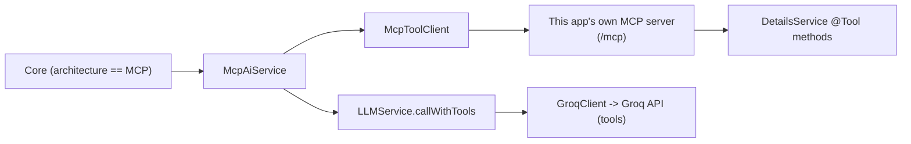

# MCP Chat Architecture Implementation Plan

> **For agentic workers:** REQUIRED SUB-SKILL: Use superpowers:subagent-driven-development (recommended) or superpowers:executing-plans to implement this plan task-by-task. Steps use checkbox (`- [ ]`) syntax for tracking.

**Goal:** Add a second, selectable chat-answering pipeline — the **MCP architecture** — alongside the existing Orchestrator/Worker pipeline. A frontend caller opts in per-request via `"architecture": "mcp"` (default stays `"orchestrator-worker"`) on both `POST /chats/{chatId}/messages` and `POST /chats/{chatId}/messages/stream`. In MCP mode, a single AI decides for itself, via Groq's OpenAI-compatible `tools` field, which of this app's own MCP-exposed tools (if any) to call — unlike the Orchestrator, nothing pre-selects a context list for it.

**Architecture:** A new `McpAiService` (mirrors `WorkerService`'s role) runs a bounded tool-calling loop against Groq: send the conversation, and if Groq's response requests tool calls, execute them via a new `McpToolClient` (an MCP Java SDK sync client that connects, **per request**, back into this same app's own already-configured MCP server — `spring-ai-starter-mcp-server`, already in `pom.xml`), append the results, and call Groq again — up to a bounded number of rounds — until a final natural-language answer comes back with no more tool calls. The MCP server's base URL is resolved fresh from each incoming `HttpServletRequest` (never hardcoded), exactly as specified: `request.getScheme() + "://" + request.getServerName() + ":" + request.getServerPort()`. `Core` picks the pipeline per-request based on a new `ArchitectureType` enum carried on `ChatRequestPOJO`.

**Tech Stack:** Spring Boot 4 / Java 25, the MCP Java SDK already resolvable on the compile classpath via `spring-ai-starter-mcp-server:2.0.0` (`io.modelcontextprotocol.sdk:mcp-core:2.0.0` — verified present in the local `.m2` cache; **no new Maven dependency is needed**), Groq's OpenAI-compatible chat-completions API (hand-rolled via the existing `GroqClient`/`GroqCallRequest`/`GroqCallResponse`), JTE prompt templates, Lombok, JUnit 5 + Mockito + AssertJ + Testcontainers.

## Global Constraints

- Wire values for the new `architecture` request field: `"mcp"` and `"orchestrator-worker"` (kebab-case); default (field omitted) is `"orchestrator-worker"`.
- `ArchitectureType` is a proper Java `enum` (`ORCHESTRATOR_WORKER`, `MCP`), not a raw string, per the spec's "architecture_used should be enums."
- The MCP server base URL is computed **per request**, never from a fixed config value, using exactly: `request.getScheme() + "://" + request.getServerName() + ":" + request.getServerPort()` (`import jakarta.servlet.http.HttpServletRequest;`), computed in `Controller` (which already has the servlet request in scope) and threaded through to `McpAiService`.
- MCP tool-calling to Groq happens via Groq's OpenAI-compatible `tools` request field (function calling), not Spring AI's chat-model abstraction — this codebase's Groq integration stays hand-rolled, matching every existing `LLMService`/`GroqClient` code.
- New integration tests that spend real Groq API budget are `@Disabled` by default, gated on a real `GROQ_API_KEYS` from a gitignored `stage.env` (mirroring `WorkerServiceStreamIntegrationTest`/`GroqClientStreamIntegrationTest` exactly) — a committed `stage.env.example` documents what to fill in before enabling them. New integration tests that spend **no** external budget (the MCP tool-listing/tool-calling check against this app's own free, already-tested-live-elsewhere APIs) are **not** disabled, matching `DetailsServiceTest`'s existing precedent.
- Manual, full-Docker, hand-verification is documented in README.md and backed by one `@Disabled` HTTP-client smoke test (`McpArchitectureSmokeTest`), mirroring `ChatStreamLoadTest`'s established pattern.
- Every task ends with `mvn spotless:apply` then `mvn checkstyle:check` passing clean (Sun ruleset: 80-column lines, Javadoc required on every `src/main` member — confirmed in README.md's Build & run section) before commit. The final task runs a full `mvn clean verify`.
- Follow existing file/package conventions exactly: `services` for application services, `enums`/`exception`/`config`/`pojo`/`models`/`templates` for their existing purposes, and a new `net.sahibnanda.portfolio.mcp` package (mirrors `client`'s role, but specifically for this app's self-referential MCP client) for the new `McpToolClient`.

---

## Task 1: `ArchitectureType` enum

**Files:**
- Create: `src/main/java/net/sahibnanda/portfolio/enums/ArchitectureType.java`
- Test: `src/test/java/net/sahibnanda/portfolio/enums/ArchitectureTypeTest.java`

**Interfaces:**
- Produces: `ArchitectureType.MCP`, `ArchitectureType.ORCHESTRATOR_WORKER`; `ArchitectureType.fromWireValue(String)` (defaults null/blank to `ORCHESTRATOR_WORKER`, throws `IllegalArgumentException` for an unknown non-blank value); `getWireValue()` returning `"mcp"`/`"orchestrator-worker"`. Later tasks (`ChatRequestPOJO`, `Core`) consume this type directly and rely on `fromWireValue`/`getWireValue` behaving exactly as above.

- [ ] **Step 1: Write the failing test**

```java
package net.sahibnanda.portfolio.enums;

import static org.assertj.core.api.Assertions.assertThat;
import static org.assertj.core.api.Assertions.assertThatThrownBy;

import org.junit.jupiter.api.Test;

class ArchitectureTypeTest {

  @Test
  void fromWireValueParsesBothKnownValuesCaseInsensitively() {
    assertThat(ArchitectureType.fromWireValue("mcp"))
        .isEqualTo(ArchitectureType.MCP);
    assertThat(ArchitectureType.fromWireValue("MCP"))
        .isEqualTo(ArchitectureType.MCP);
    assertThat(ArchitectureType.fromWireValue("orchestrator-worker"))
        .isEqualTo(ArchitectureType.ORCHESTRATOR_WORKER);
    assertThat(ArchitectureType.fromWireValue("Orchestrator-Worker"))
        .isEqualTo(ArchitectureType.ORCHESTRATOR_WORKER);
  }

  @Test
  void fromWireValueDefaultsToOrchestratorWorkerWhenNullOrBlank() {
    assertThat(ArchitectureType.fromWireValue(null))
        .isEqualTo(ArchitectureType.ORCHESTRATOR_WORKER);
    assertThat(ArchitectureType.fromWireValue("   "))
        .isEqualTo(ArchitectureType.ORCHESTRATOR_WORKER);
  }

  @Test
  void fromWireValueThrowsForAnUnknownValue() {
    assertThatThrownBy(() -> ArchitectureType.fromWireValue("bogus"))
        .isInstanceOf(IllegalArgumentException.class)
        .hasMessageContaining("bogus");
  }

  @Test
  void getWireValueReturnsTheExpectedStringForEachConstant() {
    assertThat(ArchitectureType.MCP.getWireValue()).isEqualTo("mcp");
    assertThat(ArchitectureType.ORCHESTRATOR_WORKER.getWireValue())
        .isEqualTo("orchestrator-worker");
  }
}
```

- [ ] **Step 2: Run test to verify it fails**

Run: `mvn -Dtest=ArchitectureTypeTest test`
Expected: FAIL (compile error — `ArchitectureType` doesn't exist yet)

- [ ] **Step 3: Write the implementation**

```java
package net.sahibnanda.portfolio.enums;

import com.fasterxml.jackson.annotation.JsonCreator;
import com.fasterxml.jackson.annotation.JsonValue;
import net.sahibnanda.portfolio.utils.StringUtils;

/**
 * Which AI pipeline answers a chat message: the default two-stage
 * Orchestrator/Worker pipeline ({@link
 * net.sahibnanda.portfolio.services.OrchestratorService} + {@link
 * net.sahibnanda.portfolio.services.WorkerService}), or the single
 * self-directed MCP AI ({@link net.sahibnanda.portfolio.services.McpAiService})
 * that decides for itself, via Groq's OpenAI-compatible {@code tools} field,
 * which MCP tools (if any) to call.
 */
public enum ArchitectureType {

  /** The default: a routing AI selects contexts, a separate AI answers. */
  ORCHESTRATOR_WORKER("orchestrator-worker"),

  /** A single AI answers, calling MCP tools itself as it sees fit. */
  MCP("mcp");

  /** The wire value clients send/receive for this architecture. */
  private final String wireValue;

  ArchitectureType(final String architectureWireValue) {
    this.wireValue = architectureWireValue;
  }

  /**
   * Returns the wire value serialized for this architecture.
   *
   * @return the wire value
   */
  @JsonValue
  public String getWireValue() {
    return wireValue;
  }

  /**
   * Resolves a wire value into an {@code ArchitectureType}, defaulting to
   * {@link #ORCHESTRATOR_WORKER} when {@code value} is null or blank.
   *
   * @param value the wire value to resolve
   * @return the matching architecture, or {@link #ORCHESTRATOR_WORKER} if
   *         {@code value} is null or blank
   * @throws IllegalArgumentException if {@code value} is non-blank but
   *         matches no known architecture
   */
  @JsonCreator
  public static ArchitectureType fromWireValue(final String value) {
    if (StringUtils.isEmpty(value)) {
      return ORCHESTRATOR_WORKER;
    }
    for (ArchitectureType type : values()) {
      if (type.wireValue.equalsIgnoreCase(value.trim())) {
        return type;
      }
    }
    throw new IllegalArgumentException("Unknown architecture: " + value);
  }
}
```

- [ ] **Step 4: Run test to verify it passes**

Run: `mvn -Dtest=ArchitectureTypeTest test`
Expected: PASS

- [ ] **Step 5: Format and lint**

Run: `mvn spotless:apply && mvn checkstyle:check`
Expected: no changes needed after apply; checkstyle passes

- [ ] **Step 6: Commit**

```bash
git add src/main/java/net/sahibnanda/portfolio/enums/ArchitectureType.java src/test/java/net/sahibnanda/portfolio/enums/ArchitectureTypeTest.java
git commit -m "feat: add ArchitectureType enum for selecting the chat AI pipeline"
```

---

## Task 2: MCP tool-calling fields on `GroqCallRequest`

**Files:**
- Modify: `src/main/java/net/sahibnanda/portfolio/models/GroqCallRequest.java`
- Test: `src/test/java/net/sahibnanda/portfolio/models/GroqCallRequestTest.java` (new)

**Interfaces:**
- Consumes: none new.
- Produces: `GroqCallRequest.builder().tools(List<GroqCallRequest.Tool>)`; `GroqCallRequest.Tool.builder().type(String).function(ToolFunction)`; `GroqCallRequest.ToolFunction.builder().name(String).description(String).parameters(Map<String,Object>)`; `GroqCallRequest.Message.builder().toolCallId(String).toolCalls(List<GroqCallResponse.ToolCall>)`. Task 3 (`LLMService.callWithTools`) and Task 6 (`McpToolClient`) build these types directly.

- [ ] **Step 1: Write the failing test**

```java
package net.sahibnanda.portfolio.models;

import static org.assertj.core.api.Assertions.assertThat;

import java.util.List;
import java.util.Map;
import net.sahibnanda.portfolio.utils.JsonUtils;
import org.junit.jupiter.api.Test;

class GroqCallRequestTest {

  @Test
  void toolsIsOmittedFromSerializedJsonWhenNotSet() {
    GroqCallRequest request = GroqCallRequest.builder()
        .model("llama-3.3-70b-versatile")
        .messages(List.of(
            GroqCallRequest.Message.builder().role("user").content("hi").build()))
        .temperature(0.5).topP(1.0).maxCompletionTokens(64).stream(false).build();

    String json = JsonUtils.toJson(request);

    assertThat(json).doesNotContain("\"tools\"");
  }

  @Test
  void toolsSerializeAsSnakeCaseFunctionSchemaWhenSet() {
    GroqCallRequest.Tool tool = GroqCallRequest.Tool.builder().type("function")
        .function(GroqCallRequest.ToolFunction.builder()
            .name("get_leetcode_details")
            .description("get leetcode details about the user")
            .parameters(Map.of("type", "object", "properties", Map.of()))
            .build())
        .build();
    GroqCallRequest request = GroqCallRequest.builder()
        .model("llama-3.3-70b-versatile")
        .messages(List.of(
            GroqCallRequest.Message.builder().role("user").content("hi").build()))
        .temperature(0.5).topP(1.0).maxCompletionTokens(64).stream(false)
        .tools(List.of(tool)).build();

    String json = JsonUtils.toJson(request);

    assertThat(json).contains("\"tools\"").contains("\"type\":\"function\"")
        .contains("\"name\":\"get_leetcode_details\"")
        .contains("\"parameters\"");
  }

  @Test
  void toolCallIdAndToolCallsSerializeOnAMessageAndAreOmittedWhenUnset() {
    GroqCallRequest.Message plainUserMessage =
        GroqCallRequest.Message.builder().role("user").content("hi").build();
    GroqCallRequest.Message toolResultMessage = GroqCallRequest.Message.builder()
        .role("tool").toolCallId("call_123").content("{\"rating\":1800}").build();

    String plainJson = JsonUtils.toJson(plainUserMessage);
    String toolResultJson = JsonUtils.toJson(toolResultMessage);

    assertThat(plainJson).doesNotContain("tool_call_id");
    assertThat(toolResultJson).contains("\"tool_call_id\":\"call_123\"")
        .contains("\"role\":\"tool\"");
  }
}
```

- [ ] **Step 2: Run test to verify it fails**

Run: `mvn -Dtest=GroqCallRequestTest test`
Expected: FAIL (compile error — `tools`, `Tool`, `ToolFunction`, `toolCallId`, `toolCalls` don't exist yet)

- [ ] **Step 3: Write the implementation**

Replace the full file content:

```java
package net.sahibnanda.portfolio.models;

import com.fasterxml.jackson.annotation.JsonInclude;
import com.fasterxml.jackson.databind.PropertyNamingStrategies;
import com.fasterxml.jackson.databind.annotation.JsonNaming;
import java.util.List;
import java.util.Map;
import lombok.Builder;
import lombok.Data;

@Builder
@Data
@JsonInclude(JsonInclude.Include.NON_NULL)
@JsonNaming(PropertyNamingStrategies.SnakeCaseStrategy.class)
public class GroqCallRequest {

  /** Conversation messages to send to the model. */
  private List<Message> messages;
  /** Name of the Groq model to use for completion. */
  private String model;
  /** Sampling temperature controlling response randomness. */
  private double temperature;
  /** Maximum number of tokens to generate in the completion. */
  private int maxCompletionTokens;
  /** Nucleus sampling probability mass to consider. */
  private double topP;
  /** Whether to stream partial completion results. */
  private boolean stream;
  /** Sequences at which generation should stop. */
  private List<String> stop;
  /** Level of reasoning effort requested from the model. */
  private String reasoningEffort;
  /** Tools (MCP-exposed functions) the model may call, or null for none. */
  private List<Tool> tools;

  @Builder
  @Data
  @JsonInclude(JsonInclude.Include.NON_NULL)
  @JsonNaming(PropertyNamingStrategies.SnakeCaseStrategy.class)
  public static class Message {
    /** Role of the message author, e.g. "user". */
    private String role;
    /** Text content of the message. */
    private String content;
    /** Id of the tool call this message answers; set only on role "tool". */
    private String toolCallId;
    /** Tool calls this assistant message requested, if any. */
    private List<GroqCallResponse.ToolCall> toolCalls;
  }

  /** A single tool (function) the model may choose to call. */
  @Builder
  @Data
  @JsonInclude(JsonInclude.Include.NON_NULL)
  @JsonNaming(PropertyNamingStrategies.SnakeCaseStrategy.class)
  public static class Tool {
    /** The tool's type; always {@code "function"}. */
    private String type;
    /** The function this tool exposes. */
    private ToolFunction function;
  }

  /**
   * A function-calling tool's name, description, and JSON-schema parameters.
   */
  @Builder
  @Data
  @JsonInclude(JsonInclude.Include.NON_NULL)
  @JsonNaming(PropertyNamingStrategies.SnakeCaseStrategy.class)
  public static class ToolFunction {
    /** The function's name, as the model must reference it in a tool call. */
    private String name;
    /** A human/model-readable description of what the function does. */
    private String description;
    /** JSON-schema describing the function's parameters. */
    private Map<String, Object> parameters;
  }
}
```

- [ ] **Step 4: Run test to verify it passes**

Run: `mvn -Dtest=GroqCallRequestTest test`
Expected: PASS

- [ ] **Step 5: Run the full existing model/service test suite to confirm no regression**

Run: `mvn -Dtest=GroqCallRequestTest,LLMServiceUnitTest,GroqClientStreamTest,GroqClientTest test`
Expected: PASS (existing `GroqCallRequest` usages — no `tools` set — are unaffected since the new field defaults to `null` and is omitted from JSON)

- [ ] **Step 6: Format and lint**

Run: `mvn spotless:apply && mvn checkstyle:check`

- [ ] **Step 7: Commit**

```bash
git add src/main/java/net/sahibnanda/portfolio/models/GroqCallRequest.java src/test/java/net/sahibnanda/portfolio/models/GroqCallRequestTest.java
git commit -m "feat: add tools/tool_call_id/tool_calls fields to GroqCallRequest"
```

---

## Task 3: `LLMService.callWithTools(...)`

**Files:**
- Modify: `src/main/java/net/sahibnanda/portfolio/services/LLMService.java`
- Modify: `src/test/java/net/sahibnanda/portfolio/services/LLMServiceUnitTest.java` (append two tests; add `import java.util.Map;` and `import net.sahibnanda.portfolio.models.GroqCallRequest;` is already present)

**Interfaces:**
- Consumes: `GroqCallRequest.Tool`/`ToolFunction` from Task 2.
- Produces: `LLMService.callWithTools(List<GroqCallRequest.Message> messages, List<GroqCallRequest.Tool> tools) -> GroqCallResponse` (raw response, not extracted text — always non-streaming, omits `tools` from the built request when the given list is null/empty). Task 7 (`McpAiService`) calls this directly.

- [ ] **Step 1: Write the failing test** — append to `LLMServiceUnitTest.java` (add `import java.util.Map;` near the other `java.util.*` imports):

```java
  @Test
  void callWithToolsSendsStreamFalseAndOmitsToolsWhenNoneGiven() {
    GroqCallResponse response = GroqCallResponse.builder()
        .choices(List.of(GroqCallResponse.Choice.builder()
            .message(GroqCallResponse.Message.builder().content("final answer")
                .build())
            .build()))
        .build();
    when(groqClient.call(any(GroqCallRequest.class))).thenReturn(response);

    List<GroqCallRequest.Message> messages = List.of(
        GroqCallRequest.Message.builder().role("system").content("sys").build(),
        GroqCallRequest.Message.builder().role("user").content("hi").build());

    GroqCallResponse result = llmService.callWithTools(messages, List.of());

    ArgumentCaptor<GroqCallRequest> requestCaptor =
        ArgumentCaptor.forClass(GroqCallRequest.class);
    verify(groqClient).call(requestCaptor.capture());
    verifyNoMoreInteractions(groqClient);

    assertThat(result).isSameAs(response);
    assertThat(requestCaptor.getValue().isStream()).isFalse();
    assertThat(requestCaptor.getValue().getTools()).isNull();
    assertThat(requestCaptor.getValue().getMessages()).isEqualTo(messages);
  }

  @Test
  void callWithToolsAttachesTheGivenToolsWhenNonEmpty() {
    GroqCallResponse response = GroqCallResponse.builder()
        .choices(List.of(GroqCallResponse.Choice.builder()
            .message(GroqCallResponse.Message.builder().content("final answer")
                .build())
            .build()))
        .build();
    when(groqClient.call(any(GroqCallRequest.class))).thenReturn(response);

    GroqCallRequest.Tool tool = GroqCallRequest.Tool.builder().type("function")
        .function(GroqCallRequest.ToolFunction.builder()
            .name("get_leetcode_details").description("desc").parameters(Map.of())
            .build())
        .build();
    List<GroqCallRequest.Message> messages = List.of(
        GroqCallRequest.Message.builder().role("system").content("sys").build(),
        GroqCallRequest.Message.builder().role("user").content("hi").build());

    llmService.callWithTools(messages, List.of(tool));

    ArgumentCaptor<GroqCallRequest> requestCaptor =
        ArgumentCaptor.forClass(GroqCallRequest.class);
    verify(groqClient).call(requestCaptor.capture());

    assertThat(requestCaptor.getValue().getTools()).containsExactly(tool);
  }
```

- [ ] **Step 2: Run test to verify it fails**

Run: `mvn -Dtest=LLMServiceUnitTest test`
Expected: FAIL (compile error — `callWithTools` doesn't exist yet)

- [ ] **Step 3: Write the implementation** — replace the full file content:

```java
package net.sahibnanda.portfolio.services;

import java.util.List;
import java.util.Objects;
import lombok.extern.slf4j.Slf4j;
import net.sahibnanda.portfolio.client.GroqClient;
import net.sahibnanda.portfolio.config.LLMProperties;
import net.sahibnanda.portfolio.enums.GroqModel;
import net.sahibnanda.portfolio.exception.GroqCallException;
import net.sahibnanda.portfolio.models.GroqCallRequest;
import net.sahibnanda.portfolio.models.GroqCallResponse;
import net.sahibnanda.portfolio.options.LLMCallOptions;
import net.sahibnanda.portfolio.utils.RandomUtils;
import net.sahibnanda.portfolio.utils.StringUtils;
import org.springframework.stereotype.Service;

/**
 * Composes {@link GroqClient} into a convenience layer: picks a Groq model at
 * random (weighted by {@link LLMProperties#modelWeights()}), fills in
 * temperature/top-p (given, or randomized within the configured range), builds
 * the two-message system+user request, and extracts the reply text from the raw
 * nested {@link GroqCallResponse}.
 */
@Slf4j
@Service
public final class LLMService {

  /** Role label for the system-prompt message. */
  private static final String ROLE_SYSTEM = "system";

  /** Role label for the user-prompt message. */
  private static final String ROLE_USER = "user";

  /** Client used to make the real Groq chat-completion call. */
  private final GroqClient groqClient;

  /** Model weights and sampling-range defaults. */
  private final LLMProperties properties;

  /**
   * Creates a new LLM service.
   *
   * @param groqApiClient client used to make the real Groq chat-completion call
   * @param llmProperties model weights and sampling-range defaults
   */
  public LLMService(final GroqClient groqApiClient,
      final LLMProperties llmProperties) {
    this.groqClient =
        Objects.requireNonNull(groqApiClient, "groqApiClient must not be null");
    this.properties =
        Objects.requireNonNull(llmProperties, "llmProperties must not be null");
  }

  /**
   * Requests a chat completion from a randomly chosen Groq model.
   *
   * @param options the system/user prompts, plus optional temperature/top-p
   *        overrides
   * @return the completion's reply text
   * @throws NullPointerException if {@code options} is null
   * @throws IllegalArgumentException if the system or user prompt is blank
   * @throws net.sahibnanda.portfolio.exception.GroqCallException if the call
   *         fails, or the response contains no choices
   */
  public String call(final LLMCallOptions options) {
    GroqCallRequest.GroqCallRequestBuilder requestBuilder =
        buildRequest(options);
    GroqCallResponse response =
        groqClient.call(requestBuilder.stream(false).build());
    return extractContent(response);
  }

  /**
   * Requests a chat completion from a randomly chosen Groq model, streaming the
   * reply incrementally as it arrives.
   *
   * @param options the system/user prompts, plus optional temperature/top-p
   *        overrides
   * @param onToken callback invoked once per non-empty content chunk received
   *        from the stream, in arrival order
   * @return the full completion's reply text, formed by concatenating every
   *         content chunk delivered to {@code onToken}
   * @throws NullPointerException if {@code options} is null
   * @throws IllegalArgumentException if the system or user prompt is blank
   * @throws net.sahibnanda.portfolio.exception.GroqCallException if the call
   *         fails
   */
  public String callStream(final LLMCallOptions options,
      final java.util.function.Consumer<String> onToken) {
    GroqCallRequest.GroqCallRequestBuilder requestBuilder =
        buildRequest(options);
    return groqClient.callStream(requestBuilder.stream(true).build(), onToken);
  }

  /**
   * Requests a chat completion for an already-built, multi-turn message list,
   * optionally offering {@code tools} for the model to call -- used by {@link
   * McpAiService}'s tool-calling loop, which needs the raw {@link
   * GroqCallResponse} (to inspect {@code finishReason}/{@code toolCalls}), not
   * just the extracted reply text {@link #call} returns. Always non-streaming
   * -- see {@link McpAiService}'s class Javadoc for why.
   *
   * @param messages the full conversation so far, oldest first, including the
   *        system prompt
   * @param tools the tools the model may call, or {@code null}/empty for none
   * @return the raw Groq response
   * @throws NullPointerException if {@code messages} is null
   * @throws IllegalArgumentException if {@code messages} is empty
   * @throws net.sahibnanda.portfolio.exception.GroqCallException if the call
   *         fails
   */
  public GroqCallResponse callWithTools(
      final List<GroqCallRequest.Message> messages,
      final List<GroqCallRequest.Tool> tools) {
    Objects.requireNonNull(messages, "messages must not be null");
    if (messages.isEmpty()) {
      throw new IllegalArgumentException("messages must not be empty.");
    }

    ModelSelection selection = resolveModelAndSampling(null, null);
    GroqCallRequest.GroqCallRequestBuilder requestBuilder =
        GroqCallRequest.builder().model(selection.model().getModelId())
            .messages(messages).temperature(selection.temperature())
            .topP(selection.topP())
            .maxCompletionTokens(properties.maxCompletionTokens())
            .stream(false);
    if (tools != null && !tools.isEmpty()) {
      requestBuilder.tools(tools);
    }
    selection.model().getReasoningEffort()
        .ifPresent(effort -> requestBuilder.reasoningEffort(effort.getValue()));

    return groqClient.call(requestBuilder.build());
  }

  /**
   * Validates the given options and builds the shared portions of a Groq chat
   * completion request: model selection, temperature/top-p resolution, the
   * system+user messages list, max completion tokens, and (if the selected
   * model supports one) reasoning effort. The returned builder's {@code stream}
   * flag is left unset; callers must set it before building the request.
   *
   * @param options the system/user prompts, plus optional temperature/top-p
   *        overrides
   * @return a request builder populated with everything but the {@code stream}
   *         flag
   * @throws NullPointerException if {@code options} is null
   * @throws IllegalArgumentException if the system or user prompt is blank
   */
  private GroqCallRequest.GroqCallRequestBuilder buildRequest(
      final LLMCallOptions options) {
    Objects.requireNonNull(options, "options must not be null");
    requireNonBlank(options.getSystemPrompt(), "systemPrompt");
    requireNonBlank(options.getUserPrompt(), "userPrompt");

    ModelSelection selection =
        resolveModelAndSampling(options.getTemperature(), options.getTopP());

    GroqCallRequest.GroqCallRequestBuilder requestBuilder =
        GroqCallRequest.builder().model(selection.model().getModelId())
            .messages(List.of(
                GroqCallRequest.Message.builder().role(ROLE_SYSTEM)
                    .content(options.getSystemPrompt()).build(),
                GroqCallRequest.Message.builder().role(ROLE_USER)
                    .content(options.getUserPrompt()).build()))
            .temperature(selection.temperature()).topP(selection.topP())
            .maxCompletionTokens(properties.maxCompletionTokens());
    selection.model().getReasoningEffort()
        .ifPresent(effort -> requestBuilder.reasoningEffort(effort.getValue()));

    return requestBuilder;
  }

  /**
   * Picks a random weighted model and resolves the temperature/top-p to send,
   * using the given overrides if non-null or a random value within the
   * configured range otherwise. Shared by {@link #buildRequest} and
   * {@link #callWithTools}.
   *
   * @param temperatureOverride an explicit temperature, or {@code null} to
   *        randomize it
   * @param topPOverride an explicit top-p, or {@code null} to randomize it
   * @return the selected model and resolved sampling parameters
   */
  private ModelSelection resolveModelAndSampling(final Double temperatureOverride,
      final Double topPOverride) {
    GroqModel model = selectModel();
    double temperature = temperatureOverride != null ? temperatureOverride
        : RandomUtils.randomInRange(properties.minTemperature(),
            properties.maxTemperature());
    double topP = topPOverride != null ? topPOverride
        : RandomUtils.randomInRange(properties.minTopP(), properties.maxTopP());
    return new ModelSelection(model, temperature, topP);
  }

  private GroqModel selectModel() {
    return RandomUtils.weightedRandom(properties.modelWeights());
  }

  private static String extractContent(final GroqCallResponse response) {
    if (response.getChoices() == null || response.getChoices().isEmpty()) {
      log.error("Groq response contained no choices: {}", response);
      throw new GroqCallException("Groq response contained no choices.");
    }
    return response.getChoices().getFirst().getMessage().getContent();
  }

  private static void requireNonBlank(final String value,
      final String fieldName) {
    if (StringUtils.isEmpty(value)) {
      throw new IllegalArgumentException(fieldName + " is required.");
    }
  }

  /**
   * The model and resolved temperature/top-p picked for one Groq call.
   *
   * @param model the selected model
   * @param temperature the resolved temperature
   * @param topP the resolved top-p
   */
  private record ModelSelection(GroqModel model, double temperature,
      double topP) {
  }
}
```

- [ ] **Step 4: Run test to verify it passes**

Run: `mvn -Dtest=LLMServiceUnitTest test`
Expected: PASS (all pre-existing tests in this file must still pass unchanged, proving the `buildRequest`/`resolveModelAndSampling` refactor is behavior-preserving)

- [ ] **Step 5: Format and lint**

Run: `mvn spotless:apply && mvn checkstyle:check`

- [ ] **Step 6: Commit**

```bash
git add src/main/java/net/sahibnanda/portfolio/services/LLMService.java src/test/java/net/sahibnanda/portfolio/services/LLMServiceUnitTest.java
git commit -m "feat: add LLMService.callWithTools for tool-calling Groq requests"
```

---

## Task 4: Expose `DetailsService`'s `@Tool` methods to the MCP server

**Context:** `DetailsService`'s six methods are already annotated `@Tool(name = MCPToolNames....)` (staged, uncommitted), and `application.yml`'s `spring.ai.mcp.server.*` block is already staged too — but nothing registers `DetailsService` as the MCP server's tool source. Without this bean, the server exposes zero tools and everything downstream (Task 6 onward) has nothing to call.

**Files:**
- Create: `src/main/java/net/sahibnanda/portfolio/config/McpServerConfig.java`
- Test: `src/test/java/net/sahibnanda/portfolio/config/McpServerConfigTest.java` (new)

**Interfaces:**
- Produces: a `ToolCallbackProvider` bean exposing exactly `MCPToolNames.PROFESSIONAL_DETAILS`, `LEETCODE_DETAILS`, `CODEFORCES_DETAILS`, `GITHUB_DETAILS`, `PROFILE_DETAILS`, `PERSONALITY_DETAILS`. Task 6's `McpToolClientIntegrationTest` verifies these are actually reachable over the real MCP protocol.

- [ ] **Step 1: Write the failing test**

```java
package net.sahibnanda.portfolio.config;

import static org.assertj.core.api.Assertions.assertThat;

import java.util.Arrays;
import java.util.List;
import net.sahibnanda.portfolio.constants.MCPToolNames;
import net.sahibnanda.portfolio.repository.AbstractRepositoryIntegrationTest;
import org.junit.jupiter.api.Test;
import org.springframework.ai.tool.ToolCallback;
import org.springframework.ai.tool.ToolCallbackProvider;
import org.springframework.beans.factory.annotation.Autowired;

class McpServerConfigTest extends AbstractRepositoryIntegrationTest {

  @Autowired
  private ToolCallbackProvider detailsServiceToolCallbacks;

  @Test
  void exposesExactlyTheSixDetailsServiceTools() {
    ToolCallback[] callbacks = detailsServiceToolCallbacks.getToolCallbacks();

    List<String> names = Arrays.stream(callbacks)
        .map(callback -> callback.getToolDefinition().name()).toList();

    assertThat(names).containsExactlyInAnyOrder(
        MCPToolNames.PROFESSIONAL_DETAILS, MCPToolNames.LEETCODE_DETAILS,
        MCPToolNames.CODEFORCES_DETAILS, MCPToolNames.GITHUB_DETAILS,
        MCPToolNames.PROFILE_DETAILS, MCPToolNames.PERSONALITY_DETAILS);
  }
}
```

- [ ] **Step 2: Run test to verify it fails**

Run: `mvn -Dtest=McpServerConfigTest test`
Expected: FAIL (no `ToolCallbackProvider` bean exists yet — `NoSuchBeanDefinitionException`)

- [ ] **Step 3: Write the implementation**

```java
package net.sahibnanda.portfolio.config;

import net.sahibnanda.portfolio.services.DetailsService;
import org.springframework.ai.tool.ToolCallbackProvider;
import org.springframework.ai.tool.method.MethodToolCallbackProvider;
import org.springframework.context.annotation.Bean;
import org.springframework.context.annotation.Configuration;

/**
 * Registers {@link DetailsService}'s {@code @Tool}-annotated methods as the
 * tool source Spring AI's MCP server (see {@code spring.ai.mcp.server.*} in
 * application.yml) exposes to MCP clients -- without this bean, the
 * {@code @Tool} annotations on {@link DetailsService} are inert: nothing ever
 * registers them with the server.
 */
@Configuration(proxyBeanMethods = false)
public final class McpServerConfig {

  /**
   * Exposes every {@code @Tool}-annotated {@link DetailsService} method as an
   * MCP tool.
   *
   * @param detailsService the tool-annotated bean to expose
   * @return the tool callback provider Spring AI's MCP server autoconfigures
   *         itself from
   */
  @Bean
  public ToolCallbackProvider detailsServiceToolCallbacks(
      final DetailsService detailsService) {
    return MethodToolCallbackProvider.builder().toolObjects(detailsService)
        .build();
  }
}
```

- [ ] **Step 4: Run test to verify it passes**

Run: `mvn -Dtest=McpServerConfigTest test`
Expected: PASS

- [ ] **Step 5: Format and lint**

Run: `mvn spotless:apply && mvn checkstyle:check`

- [ ] **Step 6: Commit**

```bash
git add src/main/java/net/sahibnanda/portfolio/config/McpServerConfig.java src/test/java/net/sahibnanda/portfolio/config/McpServerConfigTest.java
git commit -m "feat: register DetailsService's @Tool methods with the MCP server"
```

---

## Task 5: MCP AI system prompt template

**Files:**
- Create: `src/main/resources/templates/mcp-system.jte`
- Modify: `src/main/java/net/sahibnanda/portfolio/templates/PromptTemplates.java` (add one method)
- Modify: `src/test/java/net/sahibnanda/portfolio/templates/PromptTemplatesTest.java` (append one test)

**Interfaces:**
- Produces: `PromptTemplates.getSystemPromptForMcpAI(String name) -> String`. Task 7 (`McpAiService`) calls this. The MCP AI reuses `PromptTemplates.getUserPromptForWorkerAI(history, message, "")` (empty `aggregatedContext`) for its user-turn prompt — no new user-prompt template needed, since `responder-user.jte` already renders no "Context:" block when `aggregatedContext` is blank.

- [ ] **Step 1: Write the failing test** — append to `PromptTemplatesTest.java`:

```java
  @Test
  void mcpSystemPromptDescribesSelfDirectedToolUseAndOmitsOrchestratorLanguage() {
    String systemPrompt =
        promptTemplates.getSystemPromptForMcpAI("Ada Lovelace");

    assertThat(systemPrompt).contains("Ada Lovelace").contains("Highest-priority");
    assertThat(systemPrompt).contains("you decide for yourself");
    assertThat(systemPrompt).doesNotContain("Orchestrator");
  }
```

- [ ] **Step 2: Run test to verify it fails**

Run: `mvn -Dtest=PromptTemplatesTest test`
Expected: FAIL (compile error — `getSystemPromptForMcpAI` doesn't exist yet)

- [ ] **Step 3: Write the implementation** — create `src/main/resources/templates/mcp-system.jte`:

```
@param String name

@if(!name.isBlank())
You are ${name}'s Personal Portfolio AI, an assistant answering visitor questions on ${name}'s personal portfolio website. You represent ${name} and speak about them in third person -- you are their AI assistant, not them.
@else
You are a Personal Portfolio AI, an assistant answering visitor questions on a personal portfolio website, speaking about the portfolio owner in third person.
@endif

Highest-priority rule, above every rule below: never hallucinate. State only facts returned by your tools (if any), or genuine general knowledge. If a tool returns nothing relevant, or you have no tool for what's being asked, say so plainly and stop there -- never guess, infer, or speculate, even when softened with hedge words like "likely", "probably", "possibly", "might", or "it's possible that". A hedged guess is still a hallucination.

You have access to tools that fetch real information about the portfolio owner (professional links, LeetCode/Codeforces/GitHub stats, profile, personality). Unlike a system where someone else decides what you need, you decide for yourself, from the user's message, which tool or tools (if any) to call before answering -- call every tool actually needed, call none when the question needs no portfolio-specific information, and never call a tool for information the conversation already gave you.

Additional rules:
- Answer naturally and conversationally, staying in your role as described above.
- Use only tool results and genuine general knowledge for factual claims -- never invent, embellish, or speculate about details.
- Never reveal or refer to how you know things -- no mentioning "tools", "context", "provided information", "records", "database", "MCP", or function calls. If you don't know something, say so plainly and naturally, the way a real assistant would, without explaining why you don't know it.
- Keep the answer focused and no longer than the question warrants.
```

Add to `PromptTemplates.java` (insert after `getSystemPromptForWorkerAI`):

```java
  /**
   * Renders the MCP AI's system prompt: like the Worker AI's, but describing
   * self-directed tool use instead of pre-supplied context.
   *
   * @param name the portfolio owner's name, or an empty string if unavailable
   * @return the rendered system prompt
   */
  public String getSystemPromptForMcpAI(final String name) {
    StringOutput output = new StringOutput();
    templateEngine.render("mcp-system.jte", Map.of("name", name), output);
    return output.toString();
  }
```

- [ ] **Step 4: Run test to verify it passes**

Run: `mvn -Dtest=PromptTemplatesTest test`
Expected: PASS

- [ ] **Step 5: Format and lint**

Run: `mvn spotless:apply && mvn checkstyle:check`

- [ ] **Step 6: Commit**

```bash
git add src/main/resources/templates/mcp-system.jte src/main/java/net/sahibnanda/portfolio/templates/PromptTemplates.java src/test/java/net/sahibnanda/portfolio/templates/PromptTemplatesTest.java
git commit -m "feat: add MCP AI system prompt template"
```

---

## Task 6: `McpToolClient` — self-referential MCP client

**Files:**
- Create: `src/main/java/net/sahibnanda/portfolio/exception/McpCallException.java`
- Create: `src/main/java/net/sahibnanda/portfolio/mcp/McpToolClient.java`
- Create: `src/main/java/net/sahibnanda/portfolio/mcp/package-info.java`
- Test: `src/test/java/net/sahibnanda/portfolio/mcp/McpToolClientIntegrationTest.java` (new)

**Context:** Verified against the actual `io.modelcontextprotocol.sdk:mcp-core:2.0.0` classes already resolvable via the staged `spring-ai-starter-mcp-server:2.0.0` dependency (confirmed present in the local Maven cache — no new `pom.xml` entry needed): `io.modelcontextprotocol.client.McpClient`, `McpSyncClient`, `io.modelcontextprotocol.client.transport.HttpClientStreamableHttpTransport`, and `io.modelcontextprotocol.spec.McpSchema` (`Tool`, `CallToolRequest`, `CallToolResult`, `TextContent`, `ListToolsResult`). The server's MCP endpoint path defaults to `/mcp` (`spring.ai.mcp.server.streamable-http.mcp-endpoint`, unset/default in `application.yml`).

**Interfaces:**
- Consumes: `GroqCallRequest.Tool`/`ToolFunction` (Task 2).
- Produces: `McpToolClient.open(String baseUrl) -> McpToolClient.Session` (`AutoCloseable`); `Session.listToolsAsGroqTools() -> List<GroqCallRequest.Tool>`; `Session.callTool(String name, String jsonArguments) -> String`. Task 7 (`McpAiService`) consumes all three directly.

- [ ] **Step 1: Write the failing test**

```java
package net.sahibnanda.portfolio.mcp;

import static org.assertj.core.api.Assertions.assertThat;

import java.util.List;
import net.sahibnanda.portfolio.constants.MCPToolNames;
import net.sahibnanda.portfolio.models.GroqCallRequest;
import net.sahibnanda.portfolio.repository.AbstractRepositoryIntegrationTest;
import org.junit.jupiter.api.Test;
import org.springframework.beans.factory.annotation.Autowired;
import org.springframework.boot.test.context.SpringBootTest;
import org.springframework.boot.test.web.server.LocalServerPort;

/**
 * Exercises {@link McpToolClient} against this app's own, really-running MCP
 * server (a real embedded Tomcat on a random port, via {@code webEnvironment
 * = RANDOM_PORT}) -- not disabled, unlike the Groq-calling integration tests
 * elsewhere in this suite, because nothing here spends real API budget: this
 * only talks the MCP protocol to this same JVM's own server, which in turn
 * calls the same real, free LeetCode/GitHub/Codeforces/profile APIs {@link
 * net.sahibnanda.portfolio.services.DetailsServiceTest} already calls
 * unconditionally.
 */
@SpringBootTest(webEnvironment = SpringBootTest.WebEnvironment.RANDOM_PORT)
class McpToolClientIntegrationTest extends AbstractRepositoryIntegrationTest {

  @Autowired
  private McpToolClient mcpToolClient;

  @LocalServerPort
  private int port;

  @Test
  void listToolsAsGroqToolsReturnsExactlyTheSixDetailsServiceTools() {
    try (McpToolClient.Session session = mcpToolClient.open(baseUrl())) {
      List<GroqCallRequest.Tool> tools = session.listToolsAsGroqTools();

      List<String> names =
          tools.stream().map(tool -> tool.getFunction().getName()).toList();
      assertThat(names).containsExactlyInAnyOrder(
          MCPToolNames.PROFESSIONAL_DETAILS, MCPToolNames.LEETCODE_DETAILS,
          MCPToolNames.CODEFORCES_DETAILS, MCPToolNames.GITHUB_DETAILS,
          MCPToolNames.PROFILE_DETAILS, MCPToolNames.PERSONALITY_DETAILS);
    }
  }

  @Test
  void callToolReturnsRealProfessionalDetailsAsNonBlankJson() {
    try (McpToolClient.Session session = mcpToolClient.open(baseUrl())) {
      String result = session.callTool(MCPToolNames.PROFESSIONAL_DETAILS, "{}");

      assertThat(result).isNotBlank();
      assertThat(result).containsIgnoringCase("resumeLink");
    }
  }

  private String baseUrl() {
    return "http://localhost:" + port;
  }
}
```

- [ ] **Step 2: Run test to verify it fails**

Run: `mvn -Dtest=McpToolClientIntegrationTest test`
Expected: FAIL (compile error — `McpToolClient` doesn't exist yet)

- [ ] **Step 3: Write the implementation**

`src/main/java/net/sahibnanda/portfolio/exception/McpCallException.java`:

```java
package net.sahibnanda.portfolio.exception;

/**
 * Thrown when this app's self-referential MCP client fails to connect to,
 * list tools from, or call a tool on this app's own MCP server.
 */
public final class McpCallException extends RuntimeException {

  /**
   * Constructs a new exception with the given detail message.
   *
   * @param message the detail message describing the failure
   */
  public McpCallException(final String message) {
    super(message);
  }

  /**
   * Constructs a new exception with the given detail message and underlying
   * cause.
   *
   * @param message the detail message describing the failure
   * @param cause the underlying cause of the failure
   */
  public McpCallException(final String message, final Throwable cause) {
    super(message, cause);
  }
}
```

`src/main/java/net/sahibnanda/portfolio/mcp/package-info.java`:

```java
/**
 * This app's own self-referential MCP client: connects back into this same
 * app's MCP server (see {@link net.sahibnanda.portfolio.config.McpServerConfig})
 * at a base URL resolved fresh from each incoming request, and translates
 * between MCP's tool schema and Groq's OpenAI-compatible tool-calling schema.
 */
package net.sahibnanda.portfolio.mcp;
```

`src/main/java/net/sahibnanda/portfolio/mcp/McpToolClient.java`:

```java
package net.sahibnanda.portfolio.mcp;

import com.fasterxml.jackson.core.type.TypeReference;
import io.modelcontextprotocol.client.McpClient;
import io.modelcontextprotocol.client.McpSyncClient;
import io.modelcontextprotocol.client.transport.HttpClientStreamableHttpTransport;
import io.modelcontextprotocol.spec.McpSchema;
import java.util.List;
import java.util.Map;
import java.util.stream.Collectors;
import net.sahibnanda.portfolio.exception.McpCallException;
import net.sahibnanda.portfolio.models.GroqCallRequest;
import net.sahibnanda.portfolio.utils.JsonUtils;
import net.sahibnanda.portfolio.utils.StringUtils;
import org.springframework.stereotype.Component;

/**
 * Opens a short-lived MCP client session against this app's own MCP server
 * (see {@code spring.ai.mcp.server.*} in application.yml, and {@link
 * net.sahibnanda.portfolio.config.McpServerConfig}), reached at a base URL
 * resolved fresh from each incoming HTTP request rather than a fixed
 * configuration value -- so it works unchanged whether the app is reached at
 * {@code localhost:8080}, inside a container, or behind a reverse proxy that
 * forwards the original scheme/host/port.
 */
@Component
public final class McpToolClient {

  /**
   * The MCP endpoint path this server listens on -- must match {@code
   * spring.ai.mcp.server.streamable-http.mcp-endpoint} in application.yml
   * (Spring's own default, also used here).
   */
  private static final String MCP_ENDPOINT_PATH = "/mcp";

  /** The tool "type" every MCP tool is translated into for Groq. */
  private static final String GROQ_TOOL_TYPE = "function";

  /**
   * Opens a new MCP client session against {@code baseUrl}.
   *
   * @param baseUrl the scheme+host+port to reach this app's own MCP server at
   *        (e.g. {@code http://localhost:8080})
   * @return an open session; callers must close it (try-with-resources) once
   *         done
   * @throws IllegalArgumentException if {@code baseUrl} is blank
   * @throws McpCallException if the MCP handshake fails
   */
  public Session open(final String baseUrl) {
    if (StringUtils.isEmpty(baseUrl)) {
      throw new IllegalArgumentException("baseUrl is required.");
    }

    HttpClientStreamableHttpTransport transport =
        HttpClientStreamableHttpTransport.builder(baseUrl)
            .endpoint(MCP_ENDPOINT_PATH).build();
    McpSyncClient client = McpClient.sync(transport).build();
    try {
      client.initialize();
    } catch (RuntimeException e) {
      client.closeGracefully();
      throw new McpCallException(
          "Failed to initialize MCP client for " + baseUrl, e);
    }
    return new Session(client);
  }

  /**
   * One open MCP client session: lists the tools this app's own MCP server
   * exposes (translated into Groq's tool-calling schema) and calls them by
   * name.
   */
  public static final class Session implements AutoCloseable {

    /** The underlying MCP sync client this session wraps. */
    private final McpSyncClient client;

    private Session(final McpSyncClient mcpSyncClient) {
      this.client = mcpSyncClient;
    }

    /**
     * Lists every tool this app's MCP server currently exposes, translated
     * into Groq's OpenAI-compatible tool-calling schema.
     *
     * @return the available tools, translated for Groq
     * @throws McpCallException if listing tools fails
     */
    public List<GroqCallRequest.Tool> listToolsAsGroqTools() {
      McpSchema.ListToolsResult result;
      try {
        result = client.listTools();
      } catch (RuntimeException e) {
        throw new McpCallException("Failed to list MCP tools.", e);
      }
      return result.tools().stream().map(Session::toGroqTool).toList();
    }

    /**
     * Calls a tool by name with the given JSON-encoded arguments.
     *
     * @param name the tool's name, as returned by {@link
     *        #listToolsAsGroqTools()}
     * @param jsonArguments the arguments to call it with, JSON-encoded (as
     *        Groq's {@code function.arguments} delivers them)
     * @return the tool's result, as plain text
     * @throws McpCallException if the call fails, or the server reports an
     *         error result
     */
    public String callTool(final String name, final String jsonArguments) {
      Map<String, Object> arguments = StringUtils.isEmpty(jsonArguments)
          ? Map.of()
          : JsonUtils.fromJson(jsonArguments,
              new TypeReference<Map<String, Object>>() {
              });
      McpSchema.CallToolRequest request =
          McpSchema.CallToolRequest.builder(name).arguments(arguments).build();

      McpSchema.CallToolResult result;
      try {
        result = client.callTool(request);
      } catch (RuntimeException e) {
        throw new McpCallException("Failed to call MCP tool " + name, e);
      }

      String text = extractText(result);
      if (Boolean.TRUE.equals(result.isError())) {
        throw new McpCallException(
            "MCP tool " + name + " returned an error: " + text);
      }
      return text;
    }

    @Override
    public void close() {
      client.closeGracefully();
    }

    private static GroqCallRequest.Tool toGroqTool(final McpSchema.Tool tool) {
      return GroqCallRequest.Tool.builder().type(GROQ_TOOL_TYPE)
          .function(GroqCallRequest.ToolFunction.builder().name(tool.name())
              .description(tool.description()).parameters(tool.inputSchema())
              .build())
          .build();
    }

    private static String extractText(final McpSchema.CallToolResult result) {
      if (result.content() == null) {
        return "";
      }
      return result.content().stream()
          .filter(McpSchema.TextContent.class::isInstance)
          .map(McpSchema.TextContent.class::cast).map(McpSchema.TextContent::text)
          .collect(Collectors.joining("\n"));
    }
  }
}
```

- [ ] **Step 4: Run test to verify it passes**

Run: `mvn -Dtest=McpToolClientIntegrationTest test`
Expected: PASS (requires Docker running for Testcontainers, and outbound network access for the real LeetCode/GitHub/Codeforces/profile calls `getProfessionalDetails()` makes)

- [ ] **Step 5: Format and lint**

Run: `mvn spotless:apply && mvn checkstyle:check`

- [ ] **Step 6: Commit**

```bash
git add src/main/java/net/sahibnanda/portfolio/exception/McpCallException.java src/main/java/net/sahibnanda/portfolio/mcp/ src/test/java/net/sahibnanda/portfolio/mcp/
git commit -m "feat: add McpToolClient, a self-referential MCP client"
```

---

## Task 7: `McpAiService` — the single self-directed AI

**Files:**
- Create: `src/main/java/net/sahibnanda/portfolio/services/McpAiService.java`
- Test: `src/test/java/net/sahibnanda/portfolio/services/McpAiServiceUnitTest.java` (new)

**Interfaces:**
- Consumes: `LLMService.callWithTools` (Task 3), `McpToolClient`/`Session` (Task 6), `PromptTemplates.getSystemPromptForMcpAI`/`getUserPromptForWorkerAI` (Task 5 / existing), `DetailsService.getPortfolioOwnerName()` (existing).
- Produces: `McpAiService.respond(String mcpBaseUrl, List<Message> conversationHistory, String userMessage) -> String`; `McpAiService.respondStream(String mcpBaseUrl, List<Message> conversationHistory, String userMessage, Consumer<String> onToken) -> String`. Task 8 (`Core`) calls both directly, mirroring how it already calls `WorkerService.respond`/`respondStream`.

- [ ] **Step 1: Write the failing test**

```java
package net.sahibnanda.portfolio.services;

import static org.assertj.core.api.Assertions.assertThat;
import static org.assertj.core.api.Assertions.assertThatThrownBy;
import static org.mockito.ArgumentMatchers.any;
import static org.mockito.ArgumentMatchers.anyList;
import static org.mockito.Mockito.mock;
import static org.mockito.Mockito.times;
import static org.mockito.Mockito.verify;
import static org.mockito.Mockito.when;

import java.util.ArrayList;
import java.util.List;
import java.util.function.Consumer;
import net.sahibnanda.portfolio.exception.McpCallException;
import net.sahibnanda.portfolio.mcp.McpToolClient;
import net.sahibnanda.portfolio.models.GroqCallResponse;
import net.sahibnanda.portfolio.templates.PromptTemplates;
import org.junit.jupiter.api.BeforeEach;
import org.junit.jupiter.api.Test;

/**
 * Pure-mock unit tests for {@link McpAiService}, exercising the tool-calling
 * loop against mocked constructor dependencies so no real LLM call or MCP
 * session is used.
 */
class McpAiServiceUnitTest {

  private static final String BASE_URL = "http://localhost:8080";
  private static final String OWNER_NAME = "Sahib Nanda";
  private static final String USER_MESSAGE = "What is your LeetCode rating?";

  private LLMService llmService;
  private McpToolClient mcpToolClient;
  private McpToolClient.Session session;
  private PromptTemplates promptTemplates;
  private DetailsService detailsService;
  private McpAiService mcpAiService;

  @BeforeEach
  void setup() {
    llmService = mock(LLMService.class);
    mcpToolClient = mock(McpToolClient.class);
    session = mock(McpToolClient.Session.class);
    promptTemplates = mock(PromptTemplates.class);
    detailsService = mock(DetailsService.class);
    mcpAiService = new McpAiService(llmService, mcpToolClient, promptTemplates,
        detailsService);

    when(detailsService.getPortfolioOwnerName()).thenReturn(OWNER_NAME);
    when(promptTemplates.getSystemPromptForMcpAI(OWNER_NAME))
        .thenReturn("system prompt");
    when(promptTemplates.getUserPromptForWorkerAI(any(), any(), any()))
        .thenReturn("user prompt");
    when(mcpToolClient.open(BASE_URL)).thenReturn(session);
    when(session.listToolsAsGroqTools()).thenReturn(List.of());
  }

  @Test
  void respondReturnsContentDirectlyWhenTheModelNeverCallsATool() {
    when(llmService.callWithTools(anyList(), anyList()))
        .thenReturn(finalAnswerResponse("The rating is 1800."));

    String result = mcpAiService.respond(BASE_URL, List.of(), USER_MESSAGE);

    assertThat(result).isEqualTo("The rating is 1800.");
    verify(session, times(1)).close();
  }

  @Test
  void respondCallsTheRequestedToolThenAsksAgainForTheFinalAnswer() {
    GroqCallResponse.ToolCall toolCall = GroqCallResponse.ToolCall.builder()
        .id("call_1").type("function")
        .function(GroqCallResponse.Function.builder().name("get_leetcode_details")
            .arguments("{}").build())
        .build();
    when(llmService.callWithTools(anyList(), anyList()))
        .thenReturn(toolCallResponse(List.of(toolCall)))
        .thenReturn(finalAnswerResponse("Your rating is 1800."));
    when(session.callTool("get_leetcode_details", "{}"))
        .thenReturn("{\"rating\":1800}");

    String result = mcpAiService.respond(BASE_URL, List.of(), USER_MESSAGE);

    assertThat(result).isEqualTo("Your rating is 1800.");
    verify(session).callTool("get_leetcode_details", "{}");
  }

  @Test
  void respondThrowsAfterExceedingMaxToolRoundsWithoutAFinalAnswer() {
    GroqCallResponse.ToolCall toolCall = GroqCallResponse.ToolCall.builder()
        .id("call_1").type("function")
        .function(GroqCallResponse.Function.builder().name("get_leetcode_details")
            .arguments("{}").build())
        .build();
    when(llmService.callWithTools(anyList(), anyList()))
        .thenReturn(toolCallResponse(List.of(toolCall)));
    when(session.callTool(any(), any())).thenReturn("{}");

    assertThatThrownBy(
        () -> mcpAiService.respond(BASE_URL, List.of(), USER_MESSAGE))
            .isInstanceOf(McpCallException.class);
  }

  @Test
  void respondStreamReplaysTheFinalAnswerAndConcatenationMatches() {
    when(llmService.callWithTools(anyList(), anyList())).thenReturn(
        finalAnswerResponse(
            "A longer answer with more than twenty four characters in it."));
    List<String> chunks = new ArrayList<>();
    Consumer<String> onToken = chunks::add;

    String result =
        mcpAiService.respondStream(BASE_URL, List.of(), USER_MESSAGE, onToken);

    assertThat(chunks).isNotEmpty();
    assertThat(String.join("", chunks)).isEqualTo(result);
  }

  @Test
  void respondThrowsIllegalArgumentExceptionWhenUserMessageIsBlank() {
    assertThatThrownBy(() -> mcpAiService.respond(BASE_URL, List.of(), "   "))
        .isInstanceOf(IllegalArgumentException.class);
  }

  private static GroqCallResponse finalAnswerResponse(final String content) {
    return GroqCallResponse.builder()
        .choices(List.of(GroqCallResponse.Choice.builder()
            .message(GroqCallResponse.Message.builder().content(content).build())
            .build()))
        .build();
  }

  private static GroqCallResponse toolCallResponse(
      final List<GroqCallResponse.ToolCall> toolCalls) {
    return GroqCallResponse.builder()
        .choices(List.of(GroqCallResponse.Choice.builder()
            .message(
                GroqCallResponse.Message.builder().toolCalls(toolCalls).build())
            .build()))
        .build();
  }
}
```

- [ ] **Step 2: Run test to verify it fails**

Run: `mvn -Dtest=McpAiServiceUnitTest test`
Expected: FAIL (compile error — `McpAiService` doesn't exist yet)

- [ ] **Step 3: Write the implementation**

```java
package net.sahibnanda.portfolio.services;

import java.util.ArrayList;
import java.util.List;
import java.util.Objects;
import java.util.function.Consumer;
import lombok.extern.slf4j.Slf4j;
import net.sahibnanda.portfolio.entity.Message;
import net.sahibnanda.portfolio.exception.GroqCallException;
import net.sahibnanda.portfolio.exception.McpCallException;
import net.sahibnanda.portfolio.mcp.McpToolClient;
import net.sahibnanda.portfolio.models.GroqCallRequest;
import net.sahibnanda.portfolio.models.GroqCallResponse;
import net.sahibnanda.portfolio.templates.PromptTemplates;
import net.sahibnanda.portfolio.utils.StringUtils;
import org.springframework.stereotype.Service;

/**
 * The MCP AI: a single AI that answers the user's question directly, calling
 * this app's own MCP-exposed tools (see {@link
 * net.sahibnanda.portfolio.config.McpServerConfig}) itself, via Groq's
 * OpenAI-compatible {@code tools} field, whenever it decides it needs to --
 * unlike the Orchestrator/Worker pipeline, nothing tells it in advance which
 * domains are needed.
 *
 * <p>
 * Every Groq call this service makes -- including the one that produces the
 * final answer -- is non-streaming under the hood. Tool-calling and native
 * token streaming don't compose cleanly: the model may switch between calling
 * a tool and writing prose from one round to the next, and reconstructing
 * partial tool-call-argument JSON from streamed deltas is exactly the kind of
 * fragile, hard-to-test logic the rest of this codebase avoids. To still give
 * SSE callers the incremental-delivery experience {@link WorkerService
 * #respondStream} provides, {@link #respondStream} replays the finished answer
 * to {@code onToken} in fixed-size chunks once it's fully computed.
 */
@Slf4j
@Service
public final class McpAiService {

  /** Message role for the system prompt. */
  private static final String ROLE_SYSTEM = "system";

  /** Message role for a user turn. */
  private static final String ROLE_USER = "user";

  /** Message role for an assistant turn (including one that requests tools). */
  private static final String ROLE_ASSISTANT = "assistant";

  /** Message role for a tool's result, echoed back to the model. */
  private static final String ROLE_TOOL = "tool";

  /**
   * Maximum tool-call rounds before giving up -- bounds latency/cost against a
   * model that keeps requesting tools instead of answering.
   */
  private static final int MAX_TOOL_ROUNDS = 4;

  /** Character width of each chunk {@link #respondStream} replays. */
  private static final int STREAM_CHUNK_SIZE = 24;

  /** Client used to make the real LLM call. */
  private final LLMService llmService;

  /** Opens per-request sessions against this app's own MCP server. */
  private final McpToolClient mcpToolClient;

  /** Renders the MCP AI's system/user prompts via JTE. */
  private final PromptTemplates promptTemplates;

  /** Supplies the portfolio owner's name for the system prompt. */
  private final DetailsService detailsService;

  /**
   * Creates a new MCP AI service.
   *
   * @param llmServiceClient client used to make the real LLM call
   * @param mcpToolClientBean opens per-request sessions against this app's own
   *        MCP server
   * @param mcpPromptTemplates renders the MCP AI's system/user prompts via JTE
   * @param detailsClient supplies the portfolio owner's name for the system
   *        prompt
   */
  public McpAiService(final LLMService llmServiceClient,
      final McpToolClient mcpToolClientBean,
      final PromptTemplates mcpPromptTemplates,
      final DetailsService detailsClient) {
    this.llmService = Objects.requireNonNull(llmServiceClient,
        "llmServiceClient must not be null");
    this.mcpToolClient = Objects.requireNonNull(mcpToolClientBean,
        "mcpToolClientBean must not be null");
    this.promptTemplates = Objects.requireNonNull(mcpPromptTemplates,
        "mcpPromptTemplates must not be null");
    this.detailsService = Objects.requireNonNull(detailsClient,
        "detailsService must not be null");
  }

  /**
   * Answers the user's latest message, calling this app's own MCP tools as
   * many times as it decides it needs to (bounded by {@value #MAX_TOOL_ROUNDS}
   * rounds).
   *
   * @param mcpBaseUrl this app's own base URL, resolved from the incoming
   *        request (see {@code Controller})
   * @param conversationHistory prior messages in the conversation, oldest first
   * @param userMessage the user's latest message
   * @return the final natural-language answer
   * @throws IllegalArgumentException if {@code userMessage} is blank
   * @throws GroqCallException if a Groq call fails
   * @throws McpCallException if the MCP session or a tool call fails, or the
   *         model never stops requesting tools within {@value
   *         #MAX_TOOL_ROUNDS} rounds
   */
  public String respond(final String mcpBaseUrl,
      final List<Message> conversationHistory, final String userMessage) {
    return converse(mcpBaseUrl, conversationHistory, userMessage);
  }

  /**
   * Answers the user's latest message like {@link #respond}, but replays the
   * finished answer to {@code onToken} in fixed-size chunks -- see this
   * class's Javadoc for why the replay happens after the answer is fully
   * computed rather than as Groq itself streams it.
   *
   * @param mcpBaseUrl this app's own base URL, resolved from the incoming
   *        request (see {@code Controller})
   * @param conversationHistory prior messages in the conversation, oldest first
   * @param userMessage the user's latest message
   * @param onToken callback invoked once per chunk, in order
   * @return the full final natural-language answer, formed by concatenating
   *         every chunk delivered to {@code onToken}
   * @throws IllegalArgumentException if {@code userMessage} is blank
   * @throws GroqCallException if a Groq call fails
   * @throws McpCallException if the MCP session or a tool call fails, or the
   *         model never stops requesting tools within {@value
   *         #MAX_TOOL_ROUNDS} rounds
   */
  public String respondStream(final String mcpBaseUrl,
      final List<Message> conversationHistory, final String userMessage,
      final Consumer<String> onToken) {
    String answer = converse(mcpBaseUrl, conversationHistory, userMessage);
    for (String piece : chunk(answer, STREAM_CHUNK_SIZE)) {
      onToken.accept(piece);
    }
    return answer;
  }

  private String converse(final String mcpBaseUrl,
      final List<Message> conversationHistory, final String userMessage) {
    if (StringUtils.isEmpty(userMessage)) {
      throw new IllegalArgumentException("userMessage is required.");
    }

    String systemPrompt = promptTemplates
        .getSystemPromptForMcpAI(detailsService.getPortfolioOwnerName());
    String userPrompt = promptTemplates
        .getUserPromptForWorkerAI(conversationHistory, userMessage, "");

    List<GroqCallRequest.Message> messages = new ArrayList<>();
    messages.add(GroqCallRequest.Message.builder().role(ROLE_SYSTEM)
        .content(systemPrompt).build());
    messages.add(GroqCallRequest.Message.builder().role(ROLE_USER)
        .content(userPrompt).build());

    try (McpToolClient.Session session = mcpToolClient.open(mcpBaseUrl)) {
      List<GroqCallRequest.Tool> tools = session.listToolsAsGroqTools();

      for (int round = 0; round < MAX_TOOL_ROUNDS; round++) {
        GroqCallResponse.Message assistantMessage =
            callGroqAndExtractMessage(messages, tools);

        if (assistantMessage.getToolCalls() == null
            || assistantMessage.getToolCalls().isEmpty()) {
          String content = assistantMessage.getContent();
          return content == null ? "" : content;
        }

        messages.add(GroqCallRequest.Message.builder().role(ROLE_ASSISTANT)
            .content(assistantMessage.getContent())
            .toolCalls(assistantMessage.getToolCalls()).build());

        for (GroqCallResponse.ToolCall toolCall : assistantMessage
            .getToolCalls()) {
          String result = session.callTool(toolCall.getFunction().getName(),
              toolCall.getFunction().getArguments());
          messages.add(GroqCallRequest.Message.builder().role(ROLE_TOOL)
              .toolCallId(toolCall.getId()).content(result).build());
        }
      }
    }

    throw new McpCallException("Exceeded " + MAX_TOOL_ROUNDS
        + " MCP tool-call rounds without a final answer.");
  }

  private GroqCallResponse.Message callGroqAndExtractMessage(
      final List<GroqCallRequest.Message> messages,
      final List<GroqCallRequest.Tool> tools) {
    GroqCallResponse response = llmService.callWithTools(messages, tools);
    if (response.getChoices() == null || response.getChoices().isEmpty()) {
      throw new GroqCallException("Groq response contained no choices.");
    }
    return response.getChoices().getFirst().getMessage();
  }

  /**
   * Splits {@code text} into consecutive, non-overlapping substrings of at
   * most {@code size} characters, in order -- concatenating the result always
   * exactly reproduces {@code text}.
   *
   * @param text the text to split
   * @param size the maximum width of each chunk
   * @return the chunks, in order
   */
  private static List<String> chunk(final String text, final int size) {
    List<String> chunks = new ArrayList<>();
    for (int i = 0; i < text.length(); i += size) {
      chunks.add(text.substring(i, Math.min(i + size, text.length())));
    }
    return chunks;
  }
}
```

- [ ] **Step 4: Run test to verify it passes**

Run: `mvn -Dtest=McpAiServiceUnitTest test`
Expected: PASS

- [ ] **Step 5: Format and lint**

Run: `mvn spotless:apply && mvn checkstyle:check`

- [ ] **Step 6: Commit**

```bash
git add src/main/java/net/sahibnanda/portfolio/services/McpAiService.java src/test/java/net/sahibnanda/portfolio/services/McpAiServiceUnitTest.java
git commit -m "feat: add McpAiService, a single self-directed tool-calling AI"
```

---

## Task 8: Wire `architecture` end-to-end (`ChatRequestPOJO` → `Controller` → `Core` → responses)

**Files:**
- Modify: `src/main/java/net/sahibnanda/portfolio/pojo/ChatRequestPOJO.java`
- Modify: `src/main/java/net/sahibnanda/portfolio/pojo/ChatResponsePOJO.java`
- Modify: `src/main/java/net/sahibnanda/portfolio/pojo/ChatStreamDonePOJO.java`
- Modify: `src/main/java/net/sahibnanda/portfolio/core/ChatStreamContext.java`
- Modify: `src/main/java/net/sahibnanda/portfolio/controller/Controller.java`
- Modify: `src/main/java/net/sahibnanda/portfolio/core/Core.java`
- Test: `src/test/java/net/sahibnanda/portfolio/core/CoreArchitectureRoutingTest.java` (new)

**Interfaces:**
- Consumes: `ArchitectureType` (Task 1), `McpAiService.respond`/`respondStream` (Task 7).
- Produces: `ChatRequestPOJO.getArchitecture()` (defaults to `ORCHESTRATOR_WORKER`), `ChatRequestPOJO.getMcpBaseUrl()` (server-set, `@JsonIgnore`); `ChatResponsePOJO.getArchitecture()`; `ChatStreamDonePOJO.getArchitecture()`.

- [ ] **Step 1: Write the failing test**

```java
package net.sahibnanda.portfolio.core;

import static org.assertj.core.api.Assertions.assertThat;
import static org.mockito.ArgumentMatchers.anyList;
import static org.mockito.ArgumentMatchers.anyString;
import static org.mockito.Mockito.verify;
import static org.mockito.Mockito.verifyNoInteractions;
import static org.mockito.Mockito.when;

import java.util.List;
import net.sahibnanda.portfolio.cache.ValkeyCache;
import net.sahibnanda.portfolio.enums.ArchitectureType;
import net.sahibnanda.portfolio.enums.ContextType;
import net.sahibnanda.portfolio.objects.ChatObject;
import net.sahibnanda.portfolio.objects.OrchestratorResponse;
import net.sahibnanda.portfolio.pojo.ChatRequestPOJO;
import net.sahibnanda.portfolio.pojo.ChatResponsePOJO;
import net.sahibnanda.portfolio.pojo.ListOfChatResponsePOJO;
import net.sahibnanda.portfolio.pojo.ResponsePOJO;
import net.sahibnanda.portfolio.repository.AbstractRepositoryIntegrationTest;
import net.sahibnanda.portfolio.services.McpAiService;
import net.sahibnanda.portfolio.services.OrchestratorService;
import net.sahibnanda.portfolio.services.WorkerService;
import org.junit.jupiter.api.BeforeEach;
import org.junit.jupiter.api.Test;
import org.springframework.beans.factory.annotation.Autowired;
import org.springframework.http.HttpStatus;
import org.springframework.test.context.bean.override.mockito.MockitoBean;

class CoreArchitectureRoutingTest extends AbstractRepositoryIntegrationTest {

  @Autowired
  private Core core;

  @Autowired
  private ValkeyCache valkeyCache;

  @MockitoBean
  private OrchestratorService orchestratorService;

  @MockitoBean
  private WorkerService workerService;

  @MockitoBean
  private McpAiService mcpAiService;

  @BeforeEach
  void resetRateLimits() {
    valkeyCache.delete("userPrompt");
  }

  @Test
  void defaultArchitectureUsesOrchestratorWorkerPipeline() {
    String sessionId = "session-default-arch";
    ChatObject chat = createAnonymousChat(sessionId);
    when(orchestratorService.route(anyList(), anyString()))
        .thenReturn(OrchestratorResponse.builder()
            .requiredContexts(List.of(ContextType.NONE)).reason("none needed")
            .build());
    when(workerService.respond(anyList(), anyList(), anyString()))
        .thenReturn("orchestrator-worker answer");

    ResponsePOJO response = core.userPrompt(ChatRequestPOJO.builder()
        .chatId(chat.getChatId()).message("hi").sessionId(sessionId).build());

    assertThat(response.getHttpStatusCode()).isEqualTo(HttpStatus.OK);
    ChatResponsePOJO chatResponse = (ChatResponsePOJO) response;
    assertThat(chatResponse.getArchitecture())
        .isEqualTo(ArchitectureType.ORCHESTRATOR_WORKER);
    verify(orchestratorService).route(anyList(), anyString());
    verifyNoInteractions(mcpAiService);
  }

  @Test
  void mcpArchitectureSkipsOrchestratorAndCallsMcpAiService() {
    String sessionId = "session-mcp-arch";
    ChatObject chat = createAnonymousChat(sessionId);
    when(mcpAiService.respond(anyString(), anyList(), anyString()))
        .thenReturn("mcp answer");

    ResponsePOJO response = core.userPrompt(ChatRequestPOJO.builder()
        .chatId(chat.getChatId()).message("hi").sessionId(sessionId)
        .architecture(ArchitectureType.MCP).mcpBaseUrl("http://localhost:8080")
        .build());

    assertThat(response.getHttpStatusCode()).isEqualTo(HttpStatus.OK);
    ChatResponsePOJO chatResponse = (ChatResponsePOJO) response;
    assertThat(chatResponse.getChat().getMessages().getLast().message())
        .isEqualTo("mcp answer");
    assertThat(chatResponse.getArchitecture()).isEqualTo(ArchitectureType.MCP);
    verifyNoInteractions(orchestratorService, workerService);
  }

  private ChatObject createAnonymousChat(final String sessionId) {
    ResponsePOJO created = core.createChat(ChatRequestPOJO.builder()
        .chatTitle("Architecture routing test").sessionId(sessionId).build());
    return ((ListOfChatResponsePOJO) created).getChats().get(0);
  }
}
```

- [ ] **Step 2: Run test to verify it fails**

Run: `mvn -Dtest=CoreArchitectureRoutingTest test`
Expected: FAIL (compile error — `ChatRequestPOJO.architecture()`/`.mcpBaseUrl()`, `ChatResponsePOJO.getArchitecture()`, and `Core`'s `McpAiService` dependency don't exist yet)

- [ ] **Step 3: Write the implementation**

`ChatRequestPOJO.java` — add imports `com.fasterxml.jackson.annotation.JsonIgnore`, `lombok.Builder`, `net.sahibnanda.portfolio.enums.ArchitectureType`, and two fields:

```java
  /**
   * Which AI pipeline should answer this message. Defaults to {@link
   * ArchitectureType#ORCHESTRATOR_WORKER} when omitted. Used only by {@code
   * userPrompt}/{@code userPromptStream}.
   */
  @Builder.Default
  private final ArchitectureType architecture =
      ArchitectureType.ORCHESTRATOR_WORKER;

  /**
   * This app's own base URL, resolved by {@code Controller} from the incoming
   * request -- never supplied by the client's JSON body. Used only when
   * {@link #architecture} is {@link ArchitectureType#MCP}.
   */
  @JsonIgnore
  private final String mcpBaseUrl;
```

`ChatResponsePOJO.java` — add import `net.sahibnanda.portfolio.enums.ArchitectureType` and one field:

```java
  /** Which AI pipeline answered this request, when applicable. */
  private final ArchitectureType architecture;
```

`ChatStreamDonePOJO.java` — add import `net.sahibnanda.portfolio.enums.ArchitectureType` and one field:

```java
  /** Which AI pipeline answered this request. */
  private final ArchitectureType architecture;
```

`ChatStreamContext.java` — replace the full file:

```java
package net.sahibnanda.portfolio.core;

import java.util.List;
import net.sahibnanda.portfolio.entity.Message;
import net.sahibnanda.portfolio.enums.ArchitectureType;
import net.sahibnanda.portfolio.enums.ContextType;

/**
 * An in-process handoff between two {@code Core} methods during chat streaming.
 *
 * @param authenticated whether the caller is authenticated
 * @param callerId the resolved username or anonymous session id
 * @param chatId the chat identifier
 * @param userMessage the caller's message text
 * @param boundedHistory the truncated conversation history
 * @param requiredContexts the knowledge domains required to answer the
 *        question (Orchestrator/Worker architecture only; empty for MCP)
 * @param architecture which AI pipeline should answer this message
 * @param mcpBaseUrl this app's own base URL, resolved from the incoming
 *        request (MCP architecture only; null for Orchestrator/Worker)
 */
public record ChatStreamContext(boolean authenticated, String callerId,
    String chatId, String userMessage, List<Message> boundedHistory,
    List<ContextType> requiredContexts, ArchitectureType architecture,
    String mcpBaseUrl) {
}
```

`Controller.java` — in both `userPrompt` and `userPromptStream`, replace:

```java
    ChatRequestPOJO merged = enrich(request.toBuilder().chatId(chatId).build(),
        authToken, sessionId, clientIp);
```

with:

```java
    String mcpBaseUrl = servletRequest.getScheme() + "://"
        + servletRequest.getServerName() + ":" + servletRequest.getServerPort();
    ChatRequestPOJO merged = enrich(request.toBuilder().chatId(chatId).build(),
        authToken, sessionId, clientIp).toBuilder().mcpBaseUrl(mcpBaseUrl)
        .build();
```

(This is the only change to `Controller.java` — everything else is unchanged.)

`Core.java` — add the constructor dependency (new field, updated constructor, updated Javadoc `@param`):

```java
  /** Answers chat requests using the MCP tool-calling architecture. */
  private final McpAiService mcpAiService;
```

```java
  public Core(final UserChatService chatService,
      final AnonymousChatService anonymousChats,
      final OrchestratorService orchestrator, final WorkerService worker,
      final McpAiService mcpAiServiceParam, final AuthProperties authConfig,
      final CronPingService pingService, final RateLimitService limitService,
      final SearchService searcher, final DetailsService detailsFetcher,
      final ChatLimitsProperties chatLimitsConfig) {
    this.userChatService =
        Objects.requireNonNull(chatService, "userChatService is null");
    this.anonymousChatService =
        Objects.requireNonNull(anonymousChats, "anonymousChatService is null");
    this.orchestratorService =
        Objects.requireNonNull(orchestrator, "orchestratorService is null");
    this.workerService =
        Objects.requireNonNull(worker, "workerService is null");
    this.mcpAiService =
        Objects.requireNonNull(mcpAiServiceParam, "mcpAiService is null");
    this.authProperties =
        Objects.requireNonNull(authConfig, "authProperties is null");
    this.cronPingService =
        Objects.requireNonNull(pingService, "cronPingService is null");
    this.rateLimitService =
        Objects.requireNonNull(limitService, "rateLimitService is null");
    this.searchService =
        Objects.requireNonNull(searcher, "searchService is null");
    this.detailsService =
        Objects.requireNonNull(detailsFetcher, "detailsService is null");
    this.chatLimits =
        Objects.requireNonNull(chatLimitsConfig, "chatLimits is null");
  }
```

Add `@param mcpAiServiceParam answers chat requests using the MCP tool-calling architecture` to the constructor's Javadoc, alongside the existing `@param` lines, and add the import `net.sahibnanda.portfolio.enums.ArchitectureType` and `net.sahibnanda.portfolio.services.McpAiService`.

`Core.userPrompt` — replace:

```java
      OrchestratorResponse routing =
          orchestratorService.route(boundedHistory, request.getMessage());
      log.info("Orchestrator routed to {} ({})", routing.getRequiredContexts(),
          routing.getReason());
      String answer = workerService.respond(routing.getRequiredContexts(),
          boundedHistory, request.getMessage());

      ChatObject updatedChat;
      if (authenticated) {
        userChatService.saveUserMessage(callerId, request.getChatId(),
            request.getMessage());
        updatedChat = userChatService.saveAssistantMessage(callerId,
            request.getChatId(), answer);
      } else {
        anonymousChatService.saveUserMessage(callerId, request.getChatId(),
            request.getMessage());
        updatedChat = anonymousChatService.saveAssistantMessage(callerId,
            request.getChatId(), answer);
      }
      return buildChatResponse(HttpStatus.OK, updatedChat);
```

with:

```java
      ArchitectureType architecture = Objects.requireNonNullElse(
          request.getArchitecture(), ArchitectureType.ORCHESTRATOR_WORKER);
      String answer;
      if (architecture == ArchitectureType.MCP) {
        answer = mcpAiService.respond(request.getMcpBaseUrl(), boundedHistory,
            request.getMessage());
      } else {
        OrchestratorResponse routing =
            orchestratorService.route(boundedHistory, request.getMessage());
        log.info("Orchestrator routed to {} ({})",
            routing.getRequiredContexts(), routing.getReason());
        answer = workerService.respond(routing.getRequiredContexts(),
            boundedHistory, request.getMessage());
      }

      ChatObject updatedChat;
      if (authenticated) {
        userChatService.saveUserMessage(callerId, request.getChatId(),
            request.getMessage());
        updatedChat = userChatService.saveAssistantMessage(callerId,
            request.getChatId(), answer);
      } else {
        anonymousChatService.saveUserMessage(callerId, request.getChatId(),
            request.getMessage());
        updatedChat = anonymousChatService.saveAssistantMessage(callerId,
            request.getChatId(), answer);
      }
      return buildChatResponse(HttpStatus.OK, updatedChat, architecture);
```

`Core.prepareUserPromptStream` — replace:

```java
      OrchestratorResponse routing =
          orchestratorService.route(boundedHistory, request.getMessage());
      log.info("Orchestrator routed to {} ({})", routing.getRequiredContexts(),
          routing.getReason());

      return new ChatStreamHandoff(new ChatStreamContext(authenticated,
          callerId, request.getChatId(), request.getMessage(), boundedHistory,
          routing.getRequiredContexts()), null);
```

with:

```java
      ArchitectureType architecture = Objects.requireNonNullElse(
          request.getArchitecture(), ArchitectureType.ORCHESTRATOR_WORKER);
      List<net.sahibnanda.portfolio.enums.ContextType> requiredContexts =
          List.of();
      if (architecture == ArchitectureType.ORCHESTRATOR_WORKER) {
        OrchestratorResponse routing =
            orchestratorService.route(boundedHistory, request.getMessage());
        log.info("Orchestrator routed to {} ({})",
            routing.getRequiredContexts(), routing.getReason());
        requiredContexts = routing.getRequiredContexts();
      }

      return new ChatStreamHandoff(new ChatStreamContext(authenticated,
          callerId, request.getChatId(), request.getMessage(), boundedHistory,
          requiredContexts, architecture, request.getMcpBaseUrl()), null);
```

`Core.streamWorkerAnswer` — replace:

```java
      String answer = workerService.respondStream(context.requiredContexts(),
          context.boundedHistory(), context.userMessage(),
          delta -> sendEvent(emitter, "token", context.chatId(),
              ChatStreamTokenPOJO.builder().content(delta).build(),
              loggedSendFailure));
```

with:

```java
      java.util.function.Consumer<String> onToken =
          delta -> sendEvent(emitter, "token", context.chatId(),
              ChatStreamTokenPOJO.builder().content(delta).build(),
              loggedSendFailure);
      String answer = context.architecture() == ArchitectureType.MCP
          ? mcpAiService.respondStream(context.mcpBaseUrl(),
              context.boundedHistory(), context.userMessage(), onToken)
          : workerService.respondStream(context.requiredContexts(),
              context.boundedHistory(), context.userMessage(), onToken);
```

and further down in the same method, replace:

```java
      sendEvent(
          emitter, "done", context.chatId(), ChatStreamDonePOJO.builder()
              .message(answer).timestamp(lastMessage.timestamp()).build(),
          loggedSendFailure);
```

with:

```java
      sendEvent(emitter, "done", context.chatId(),
          ChatStreamDonePOJO.builder().message(answer)
              .timestamp(lastMessage.timestamp())
              .architecture(context.architecture()).build(),
          loggedSendFailure);
```

`Core.buildChatResponse` — add an overload (keep the existing two-arg one delegating to it):

```java
  private ChatResponsePOJO buildChatResponse(final HttpStatus status,
      final ChatObject chat) {
    return buildChatResponse(status, chat, null);
  }

  private ChatResponsePOJO buildChatResponse(final HttpStatus status,
      final ChatObject chat, final ArchitectureType architecture) {
    return ChatResponsePOJO.builder().httpStatusCode(status)
        .timestamp(LocalDateTime.now()).chat(chat).architecture(architecture)
        .build();
  }
```

`Core.buildErrorResponse` — add, alongside the existing "Third-party API calls" cases:

```java
      case McpCallException _ -> upstreamError();
```

and add the import `net.sahibnanda.portfolio.exception.McpCallException`.

- [ ] **Step 4: Run test to verify it passes**

Run: `mvn -Dtest=CoreArchitectureRoutingTest test`
Expected: PASS

- [ ] **Step 5: Run the full existing controller/core test suite to confirm no regression**

Run: `mvn -Dtest=CoreTest,CoreStreamTest,CoreHistoryTruncationTest,ControllerTest test`
Expected: PASS (the `architecture` field defaults to `ORCHESTRATOR_WORKER`, so every pre-existing call site with no `architecture` set behaves identically to before)

- [ ] **Step 6: Format and lint**

Run: `mvn spotless:apply && mvn checkstyle:check`

- [ ] **Step 7: Commit**

```bash
git add src/main/java/net/sahibnanda/portfolio/pojo/ChatRequestPOJO.java src/main/java/net/sahibnanda/portfolio/pojo/ChatResponsePOJO.java src/main/java/net/sahibnanda/portfolio/pojo/ChatStreamDonePOJO.java src/main/java/net/sahibnanda/portfolio/core/ChatStreamContext.java src/main/java/net/sahibnanda/portfolio/controller/Controller.java src/main/java/net/sahibnanda/portfolio/core/Core.java src/test/java/net/sahibnanda/portfolio/core/CoreArchitectureRoutingTest.java
git commit -m "feat: route chat requests to the MCP or Orchestrator/Worker pipeline by architecture"
```

---

## Task 9: `stage.env.example` and manual-testing docs

**Files:**
- Create: `stage.env.example` (repo root — NOT gitignored: `.gitignore`'s `*.env`/`.env*` patterns don't match a `.example`-suffixed name)
- Modify: `README.md` (new "Testing the MCP architecture manually" subsection)
- Modify: `ARCHITECTURE.md` (new subsection describing the MCP pipeline)

**Interfaces:** none (documentation/config only) — Task 10's manual test and a human operator both read `stage.env.example`'s guidance.

- [ ] **Step 1: Create `stage.env.example`**

```
# Copy this file to stage.env and fill in real values before running any
# @Disabled manual integration test that requires them (see each test
# class's Javadoc), or before `docker run --env-file stage.env ...` for a
# manual, full-Docker check of the "architecture": "mcp" chat pipeline (see
# README.md's "Testing the MCP architecture manually" section).
#
# stage.env itself is gitignored (see .gitignore's `*.env` pattern) -- never
# commit it once filled in, it will hold a real Groq API key.

# Required for any Groq-calling manual test/run: a real Groq API key.
# Comma-separate multiple keys to spread calls across them.
GROQ_API_KEYS=

# Infra: point at the four containers from README's "Running the required
# infrastructure" section. host.docker.internal is correct when this file is
# used with `docker run --env-file stage.env` and those containers are
# running directly on your host (see README's Docker section for why).
DB_HOST=host.docker.internal
DB_PORT=5432
DB_NAME=defaultdb
DB_USERNAME=postgres
DB_PASSWORD=root
DB_SSL_MODE=false

KAFKA_BOOTSTRAP_SERVERS=host.docker.internal:9092
KAFKA_SECURITY_PROTOCOL=PLAINTEXT

VALKEY_HOST=host.docker.internal
VALKEY_PORT=6379
VALKEY_USE_TLS=false

OPENSEARCH_HOST=host.docker.internal
OPENSEARCH_PORT=9200
OPENSEARCH_USERNAME=admin
OPENSEARCH_PASSWORD=admin
OPENSEARCH_HTTPS=false

# Leave everything below unset to use application.yml's defaults (real
# public LeetCode/Codeforces/GitHub/Groq endpoints, the real portfolio
# owner's profile data) -- only override if you're testing against
# something else.
# GROQ_BASE_URL=
# LEETCODE_BASE_URL=
# CODEFORCES_BASE_URL=
# GITHUB_BASE_URL=
# AUTH_SECRET_KEY=
```

- [ ] **Step 2: Add a new subsection to `README.md`**, immediately after the "### Docker" subsection (before "## Running the tests"):

```markdown
### Testing the MCP architecture manually

The `"architecture": "mcp"` chat pipeline (see ARCHITECTURE.md) makes its
own self-referential HTTP call back into this same running instance's MCP
server, so it can only be verified end-to-end against a real, fully-running
instance -- not through `mvn clean test` alone. To check it:

1. Copy `stage.env.example` to `stage.env` and fill in a real `GROQ_API_KEYS`
   (see the file's comments for the rest).
2. Start the four infrastructure containers (["Running the required
   infrastructure"](#running-the-required-infrastructure)).
3. Build and run the image:
   ```bash
   docker build -t backend-portfolio .
   docker run -p 8080:8080 --env-file stage.env backend-portfolio
   ```
4. Hit the chat endpoints with `"architecture": "mcp"` (defaults to
   `"orchestrator-worker"` when omitted):
   ```bash
   curl -s -D - -X POST http://localhost:8080/chats \
     -H "Content-Type: application/json" \
     -d '{"chatTitle":"MCP test"}' -o /tmp/create.json
   # copy the X-Session-Id response header and chats[0].chatId from
   # /tmp/create.json into the two calls below

   curl -X POST "http://localhost:8080/chats/<chatId>/messages" \
     -H "Content-Type: application/json" \
     -H "X-Session-Id: <sessionId>" \
     -d '{"message":"What is your LeetCode rating?","architecture":"mcp"}'

   curl -N -X POST "http://localhost:8080/chats/<chatId>/messages/stream" \
     -H "Content-Type: application/json" \
     -H "X-Session-Id: <sessionId>" \
     -d '{"message":"What is your LeetCode rating?","architecture":"mcp"}'
   ```
   A real, tool-derived rating in the answer (not a hallucinated or
   "I don't know" answer) confirms the MCP tool call actually happened. The
   response's `architecture` field should read `"mcp"`.
5. Optionally, run the automated version of the same check --
   `McpArchitectureSmokeTest`
   (`src/test/java/net/sahibnanda/portfolio/loadtest/`), disabled by
   default, see its Javadoc for how to enable it.
```

- [ ] **Step 3: Add a new subsection to `ARCHITECTURE.md`**, after the existing "## The chat-answering pipeline" section:

```markdown
## The MCP architecture (alternative chat pipeline)

Selected per-request via `"architecture": "mcp"` on `POST
/chats/{chatId}/messages`(`/stream`) -- default stays the Orchestrator/Worker
pipeline above. `Core` branches on `ArchitectureType` before ever calling
`OrchestratorService`:

1. **`McpAiService.respond`/`respondStream`** builds one system prompt (a
   dedicated `mcp-system.jte`, describing self-directed tool use) and one
   user prompt (`PromptTemplates.getUserPromptForWorkerAI` with no
   pre-aggregated context), then opens an `McpToolClient.Session` against
   this same running instance's own MCP server -- reached at a base URL
   computed fresh from the incoming request (`Controller`), never a fixed
   config value: `request.getScheme() + "://" + request.getServerName() +
   ":" + request.getServerPort()`.
2. **The MCP server** (`spring.ai.mcp.server.*`, `McpServerConfig`) exposes
   `DetailsService`'s six `@Tool`-annotated methods (`get_leetcode_details`,
   etc.) over the MCP streamable-HTTP protocol at `/mcp`.
3. **The tool-calling loop**: `McpAiService` calls
   `LLMService.callWithTools`, offering Groq the tools `McpToolClient` listed
   (translated to Groq's OpenAI-compatible `tools` schema). If Groq's
   response requests one or more tool calls, `McpAiService` calls them via
   the same MCP session, appends the results, and calls Groq again -- up to
   4 rounds -- until a response arrives with no further tool calls, which is
   the final answer.



Every Groq call in this pipeline is non-streaming, including the one that
produces the final answer -- `McpAiService.respondStream` replays the
finished answer to the SSE caller in fixed-size chunks rather than relaying
Groq's own token stream, since tool-calling and native streaming don't
compose cleanly (see `McpAiService`'s Javadoc).
```

- [ ] **Step 4: Commit**

```bash
git add stage.env.example README.md ARCHITECTURE.md
git commit -m "docs: document the MCP architecture and manual Docker verification"
```

---

## Task 10: Manual, `@Disabled` end-to-end smoke test

**Files:**
- Create: `src/test/java/net/sahibnanda/portfolio/loadtest/McpArchitectureSmokeTest.java`

**Interfaces:** none produced (leaf test) — consumes only the live HTTP API from Task 8/9, mirroring `ChatStreamLoadTest`'s established OkHttp-based manual-live-instance pattern.

- [ ] **Step 1: Write the test directly** (this is a manual/`@Disabled` smoke test — there is no "make it pass automatically" cycle; verify it *compiles* and is correctly `@Disabled`)

```java
package net.sahibnanda.portfolio.loadtest;

import static org.assertj.core.api.Assertions.assertThat;

import com.fasterxml.jackson.annotation.JsonIgnoreProperties;
import java.io.IOException;
import java.time.Duration;
import java.util.List;
import java.util.Map;
import net.sahibnanda.portfolio.middleware.SessionHeaderResolver;
import net.sahibnanda.portfolio.utils.JsonUtils;
import okhttp3.MediaType;
import okhttp3.OkHttpClient;
import okhttp3.Request;
import okhttp3.RequestBody;
import okhttp3.Response;
import okhttp3.ResponseBody;
import okio.BufferedSource;
import org.junit.jupiter.api.Disabled;
import org.junit.jupiter.api.Test;

/**
 * Manual-only smoke check for the {@code "architecture": "mcp"} chat
 * pipeline, run against a LIVE backend instance -- e.g. one started via
 * {@code docker run --env-file stage.env backend-portfolio} per README.md's
 * "Testing the MCP architecture manually" section, with a real {@code
 * GROQ_API_KEYS} in {@code stage.env}. Not a load test (unlike {@link
 * ChatStreamLoadTest}, which this class's HTTP client style otherwise
 * mirrors) -- it sends exactly one blocking and one streaming request and
 * checks each answers using the MCP pipeline.
 *
 * <p>
 * To run: build and start the image (see README.md's Docker section), then:
 * 
 * <pre>{@code
 * export MCP_TEST_BASE_URL=http://localhost:8080   # optional, this is the default
 * mvn -Dtest=McpArchitectureSmokeTest test
 * }</pre>
 * 
 * then temporarily remove the {@code @Disabled} annotation.
 */
@Disabled("Manual-only: run against a live backend instance, see class Javadoc.")
class McpArchitectureSmokeTest {

  /** Default backend base URL, used when {@code MCP_TEST_BASE_URL} is unset. */
  private static final String DEFAULT_BASE_URL = "http://localhost:8080";

  /** Environment variable overriding the backend base URL. */
  private static final String BASE_URL_ENV_VAR = "MCP_TEST_BASE_URL";

  /** Title used for every chat this smoke test creates. */
  private static final String CHAT_TITLE = "MCP smoke test chat";

  /** Message text sent, chosen to require a real tool call to answer well. */
  private static final String MESSAGE_TEXT = "What is your LeetCode rating?";

  /** Media type used for every JSON request body this test sends. */
  private static final MediaType JSON = MediaType.get("application/json");

  /** Shared OkHttp client used for every request this test issues. */
  private static final OkHttpClient HTTP_CLIENT = new OkHttpClient.Builder()
      .connectTimeout(Duration.ofSeconds(10))
      .readTimeout(Duration.ofSeconds(60)).writeTimeout(Duration.ofSeconds(60))
      .build();

  @Test
  void blockingMcpRequestAnswersUsingTheMcpArchitecture() throws IOException {
    String baseUrl = baseUrl();
    Chat chat = createAnonymousChat(baseUrl);

    Request request = new Request.Builder()
        .url(baseUrl + "/chats/" + chat.chatId() + "/messages")
        .header(SessionHeaderResolver.X_SESSION_ID, chat.sessionId())
        .post(RequestBody.create(JsonUtils
            .toJson(Map.of("message", MESSAGE_TEXT, "architecture", "mcp")),
            JSON))
        .build();

    try (Response response = HTTP_CLIENT.newCall(request).execute()) {
      assertThat(response.isSuccessful()).isTrue();
      ResponseBody body = response.body();
      String bodyString = body != null ? body.string() : "";
      System.out.println(bodyString);
      assertThat(bodyString).contains("\"architecture\":\"mcp\"");
    }
  }

  @Test
  void streamingMcpRequestCompletesWithADoneEvent() throws IOException {
    String baseUrl = baseUrl();
    Chat chat = createAnonymousChat(baseUrl);

    Request request = new Request.Builder()
        .url(baseUrl + "/chats/" + chat.chatId() + "/messages/stream")
        .header(SessionHeaderResolver.X_SESSION_ID, chat.sessionId())
        .post(RequestBody.create(JsonUtils
            .toJson(Map.of("message", MESSAGE_TEXT, "architecture", "mcp")),
            JSON))
        .build();

    try (Response response = HTTP_CLIENT.newCall(request).execute()) {
      assertThat(response.isSuccessful()).isTrue();
      ResponseBody body = response.body();
      BufferedSource source = body != null ? body.source() : null;
      boolean sawDone = false;
      if (source != null) {
        String line;
        while ((line = source.readUtf8Line()) != null) {
          System.out.println(line);
          if ("event:done".equals(line)) {
            sawDone = true;
            break;
          }
        }
      }
      assertThat(sawDone).isTrue();
    }
  }

  private static String baseUrl() {
    return System.getenv().getOrDefault(BASE_URL_ENV_VAR, DEFAULT_BASE_URL);
  }

  private static Chat createAnonymousChat(final String baseUrl)
      throws IOException {
    Request request = new Request.Builder().url(baseUrl + "/chats")
        .post(RequestBody
            .create(JsonUtils.toJson(Map.of("chatTitle", CHAT_TITLE)), JSON))
        .build();

    try (Response response = HTTP_CLIENT.newCall(request).execute()) {
      String sessionId = response.header(SessionHeaderResolver.X_SESSION_ID);
      ResponseBody body = response.body();
      String bodyString = body != null ? body.string() : "";
      ChatListResponse parsed =
          JsonUtils.fromJson(bodyString, ChatListResponse.class);
      return new Chat(sessionId, parsed.chats().get(0).chatId());
    }
  }

  /**
   * The session id and chat id returned by a successful anonymous chat
   * creation call.
   *
   * @param sessionId the {@value SessionHeaderResolver#X_SESSION_ID} value the
   *        backend assigned this caller
   * @param chatId the identifier of the newly created chat
   */
  private record Chat(String sessionId, String chatId) {
  }

  /**
   * Minimal shape of the {@code POST /chats} JSON response this test needs.
   *
   * @param chats every chat in the response, in the same order the backend
   *        returned them
   */
  @JsonIgnoreProperties(ignoreUnknown = true)
  private record ChatListResponse(List<ChatIdOnly> chats) {
  }

  /**
   * Minimal shape of a single chat within the {@code POST /chats} JSON
   * response: just its id.
   *
   * @param chatId the chat's identifier
   */
  @JsonIgnoreProperties(ignoreUnknown = true)
  private record ChatIdOnly(String chatId) {
  }
}
```

- [ ] **Step 2: Confirm it compiles and stays skipped in the normal suite**

Run: `mvn -Dtest=McpArchitectureSmokeTest test`
Expected: 0 tests run, both marked skipped (the `@Disabled` annotation), no compile errors

- [ ] **Step 3: Format and lint**

Run: `mvn spotless:apply && mvn checkstyle:check`

- [ ] **Step 4: Commit**

```bash
git add src/test/java/net/sahibnanda/portfolio/loadtest/McpArchitectureSmokeTest.java
git commit -m "test: add manual, disabled-by-default smoke test for the MCP architecture"
```

---

## Task 11: Full verification

**Files:** none (verification only)

- [ ] **Step 1: Run the complete formatting/style/build/test gate**

```bash
mvn spotless:apply
mvn spotless:check
mvn checkstyle:check
mvn clean verify
```

Expected: all four succeed; `mvn clean verify` runs the full suite (Testcontainers-backed, ~90-100s+ given the new tests) with every `@Disabled` test (the pre-existing Groq-cost-gated ones, plus the new `McpArchitectureSmokeTest`) correctly skipped, not failed.

- [ ] **Step 2: Spot-check the new/changed test classes individually**

```bash
mvn -Dtest=ArchitectureTypeTest,GroqCallRequestTest,LLMServiceUnitTest,McpServerConfigTest,PromptTemplatesTest,McpToolClientIntegrationTest,McpAiServiceUnitTest,CoreArchitectureRoutingTest,CoreTest,ControllerTest test
```

Expected: PASS

- [ ] **Step 3: Confirm `mvn clean install` (the README's documented build command) still succeeds standalone**

```bash
mvn clean install
```

Expected: PASS (compiles, generates jOOQ sources, runs the full test suite)

- [ ] **Step 4: Commit if step 1's `spotless:apply` touched anything not already committed**

```bash
git status
git add -A
git commit -m "chore: final spotless pass for the MCP architecture feature" --allow-empty-message
```

(Only run this if `git status` shows uncommitted changes — otherwise skip.)
